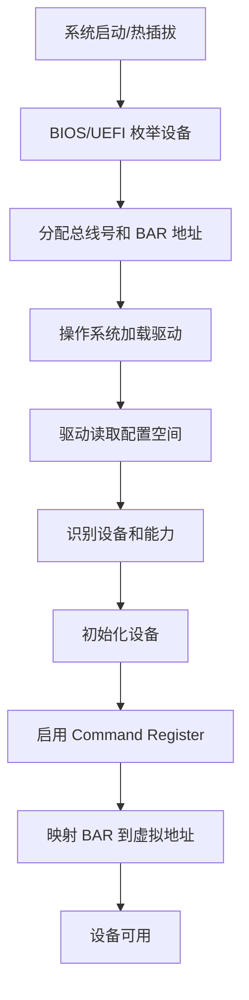

# 配置空间布局详解

Configuration Space 是 PCIe 设备的"身份证"和"控制面板"，包含设备识别信息、地址映射、能力声明等关键配置。

---

## 概述

PCIe 配置空间是每个设备必须实现的标准化寄存器区域，用于：
- **设备识别**：Vendor ID、Device ID、Class Code
- **地址映射**：Base Address Registers (BARs) 定义内存/IO 地址
- **能力声明**：通过能力链表声明支持的特性（MSI、电源管理等）
- **控制和状态**：Command/Status 寄存器控制设备行为

**两种配置空间大小**：

```
传统 PCI 配置空间 (Type 0)
┌─────────────────────────────────┐
│   0x00 - 0xFF (256 bytes)       │  标准 PCI 兼容
└─────────────────────────────────┘

PCIe 扩展配置空间 (Type 0)
┌─────────────────────────────────┐
│   0x000 - 0x0FF (256 bytes)     │  标准 PCI 区域
├─────────────────────────────────┤
│   0x100 - 0xFFF (3840 bytes)    │  PCIe 扩展区域
└─────────────────────────────────┘
总计 4096 字节 (4KB)
```

---

## 配置空间结构

### Type 0 Header（端点设备）

```
偏移    +0x0   +0x1   +0x2   +0x3   +0x4   +0x5   +0x6   +0x7
      ┌──────┬──────┬──────┬──────┬──────┬──────┬──────┬──────┐
0x00  │  Vendor ID (16)   │  Device ID (16)   │             │
      ├───────────────────┴───────────────────┤             │
0x04  │      Command (16)     │    Status (16)│             │
      ├──────┬──────┬─────────┴───────────────┤             │
0x08  │ Rev  │    Class Code (24 bits)        │  Header    │
      ├──────┼──────┬──────┬──────────────────┤   Type 0   │
0x0C  │Cache │Lat   │Header│  BIST            │             │
      │Line  │Timer │Type  │                  │             │
      ├──────┴──────┴──────┴──────────────────┤             │
0x10  │         BAR 0 (32/64 bit)             │             │
      ├───────────────────────────────────────┤             │
0x14  │         BAR 1 (32/64 bit)             │             │
      ├───────────────────────────────────────┤             │
0x18  │         BAR 2 (32/64 bit)             │             │
      ├───────────────────────────────────────┤             │
0x1C  │         BAR 3 (32/64 bit)             │             │
      ├───────────────────────────────────────┤             │
0x20  │         BAR 4 (32/64 bit)             │             │
      ├───────────────────────────────────────┤             │
0x24  │         BAR 5 (32/64 bit)             │             │
      ├───────────────────────────────────────┤             │
0x28  │      CardBus CIS Pointer              │             │
      ├───────────────────┬───────────────────┤             │
0x2C  │ Subsystem Vendor  │ Subsystem Device  │             │
      ├───────────────────┴───────────────────┤             │
0x30  │      Expansion ROM Base Address       │             │
      ├──────┬────────────────────────────────┤             │
0x34  │ Cap  │        Reserved                │             │
      │ Ptr  │                                │             │
      ├──────┴────────────────────────────────┤             │
0x38  │            Reserved                   │             │
      ├──────┬──────┬──────┬──────────────────┤             │
0x3C  │ Int  │ Int  │Min   │  Max Lat         │             │
      │ Line │ Pin  │ Grant│                  │             │
      └──────┴──────┴──────┴──────────────────┘             │
                                                             │
0x40  │    Capabilities / Device-Specific     │             │
      │                                        │             │
      └────────────────────────────────────────┘─────────────┘
```

---

## 关键字段详解

### 1. 设备识别（0x00-0x0B）

#### Vendor ID（偏移 0x00，16 bits）

设备制造商的唯一标识，由 PCI-SIG 分配。

**常见 Vendor ID**：

| Vendor ID | 厂商 |
|-----------|------|
| 0x8086 | Intel Corporation |
| 0x10DE | NVIDIA Corporation |
| 0x1022 | AMD |
| 0x144D | Samsung Electronics |
| 0x15B7 | SandForce (LSI) |
| 0x1B4B | Marvell |

#### Device ID（偏移 0x02，16 bits）

特定设备型号的标识，由厂商自行分配。

**示例**：
```c
// FEMU 代码：设置 NVMe 控制器的 Vendor/Device ID
pci_config_set_vendor_id(pci_conf, 0x8086);  // Intel
pci_config_set_device_id(pci_conf, 0x5845);  // 设备型号
```

#### Class Code（偏移 0x09，24 bits）

设备类型的标准分类。

**格式**：
```
┌──────────────┬──────────────┬──────────────┐
│ Base Class   │ Sub-Class    │ Prog IF      │
│   (8 bits)   │   (8 bits)   │  (8 bits)    │
└──────────────┴──────────────┴──────────────┘
```

**常见类别**：

| Base | Sub | Prog IF | 设备类型 |
|------|-----|---------|---------|
| 0x01 | 0x08 | 0x02 | NVMe 控制器 |
| 0x02 | 0x00 | 0x00 | 以太网控制器 |
| 0x03 | 0x00 | 0x00 | VGA 兼容控制器 |
| 0x06 | 0x04 | 0x00 | PCI-to-PCI Bridge |

**FEMU 示例**：
```c
// 设置 NVMe 设备类别
pci_config_set_class(pci_conf, PCI_CLASS_STORAGE_EXPRESS);
// 展开为：0x010802
```

---

### 2. Command Register（偏移 0x04，16 bits）

控制设备的基本操作。

```
Bit 15-11: 保留
Bit 10: Interrupt Disable (禁用 INTx 中断)
Bit 9:  Fast Back-to-Back Enable
Bit 8:  SERR# Enable
Bit 7:  保留
Bit 6:  Parity Error Response
Bit 5:  VGA Palette Snoop
Bit 4:  Memory Write and Invalidate
Bit 3:  Special Cycles
Bit 2:  Bus Master Enable (启用 DMA)
Bit 1:  Memory Space Enable (启用内存访问)
Bit 0:  I/O Space Enable (启用 IO 访问)
```

**关键位**：
- **Bit 2 (Bus Master)**：必须设置才能发起 DMA 传输
- **Bit 1 (Memory Space)**：必须设置才能访问 BAR 映射的内存
- **Bit 10 (Interrupt Disable)**：禁用传统 INTx 中断（使用 MSI/MSI-X 时设置）

**Linux 驱动示例**：
```c
// 启用设备的内存访问和总线主控
pci_set_master(pdev);  // 设置 Bus Master Enable
pci_enable_device_mem(pdev);  // 设置 Memory Space Enable
```

---

### 3. Status Register（偏移 0x06，16 bits）

报告设备状态和能力。

```
Bit 15: Detected Parity Error
Bit 14: Signaled System Error
Bit 13: Received Master Abort
Bit 12: Received Target Abort
Bit 11: Signaled Target Abort
Bit 10-9: DEVSEL Timing
Bit 8:  Master Data Parity Error
Bit 7:  Fast Back-to-Back Capable
Bit 6:  保留
Bit 5:  66 MHz Capable (已废弃)
Bit 4:  Capabilities List (有能力链表)
Bit 3:  Interrupt Status
Bit 2-0: 保留
```

**Bit 4 (Capabilities List)**：如果为 1，表示偏移 0x34 处有能力链表指针。

---

### 4. Base Address Registers (BARs)（0x10-0x27）

定义设备的内存或 IO 地址空间映射。

#### BAR 格式

**内存 BAR（Bit 0 = 0）**：
```
┌────────────────────────────────────────────────────────┬──┬──┬─┐
│         Base Address [31:4] or [63:4]                  │Pf│Ty│0│
└────────────────────────────────────────────────────────┴──┴──┴─┘
Bit 0:    0 = Memory Space
Bit 2-1:  Type (00=32-bit, 10=64-bit, 01=保留)
Bit 3:    Prefetchable (1=可预取)
Bit 31-4: Base Address (16-byte 对齐)
```

**IO BAR（Bit 0 = 1）**：
```
┌────────────────────────────────────────────────────────────┬─┐
│         Base Address [31:2]                                │1│
└────────────────────────────────────────────────────────────┴─┘
Bit 0:    1 = I/O Space
Bit 1:    保留
Bit 31-2: Base Address (4-byte 对齐)
```

#### BAR 大小探测

系统通过写入全 1 然后回读来探测 BAR 大小：

```c
// 探测 BAR0 的大小
uint32_t original = pci_read_config_dword(dev, PCI_BASE_ADDRESS_0);
pci_write_config_dword(dev, PCI_BASE_ADDRESS_0, 0xFFFFFFFF);
uint32_t size_mask = pci_read_config_dword(dev, PCI_BASE_ADDRESS_0);
pci_write_config_dword(dev, PCI_BASE_ADDRESS_0, original);

// 计算大小（假设内存 BAR）
size_mask &= ~0xF;  // 清除低 4 位
uint32_t size = ~size_mask + 1;  // 取反加一
```

**示例**：
- 读回 `0xFFFF0000` → 大小 = 64 KB
- 读回 `0xFFFFC000` → 大小 = 16 KB
- 读回 `0xFFFFFF00` → 大小 = 256 bytes

#### 64 位 BAR

使用两个连续的 BAR 寄存器：

```
BAR n   (0x10 + n*4): 低 32 位 (Type = 10b)
BAR n+1 (0x14 + n*4): 高 32 位
```

**FEMU 代码示例**：
```c
// NVMe 控制器注册 64 位内存 BAR
memory_region_init_io(&n->iomem, OBJECT(n), &nvme_mmio_ops, n,
                      "nvme", n->reg_size);
pci_register_bar(pci_dev, 0,
                 PCI_BASE_ADDRESS_SPACE_MEMORY |
                 PCI_BASE_ADDRESS_MEM_TYPE_64,
                 &n->iomem);
```

**实际应用场景**：
- **BAR0**：通常用于设备寄存器（NVMe Controller Registers）
- **BAR1**：MSI-X 表格和 PBA（如果启用 MSI-X）
- **BAR2-5**：额外的内存区域或设备特定功能

---

### 5. Capabilities Pointer（偏移 0x34，8 bits）

指向第一个能力结构的偏移（必须 DWORD 对齐）。

**能力链表结构**：

```
┌────────────────────────────────────────┐
│  Capability ID (8 bits)                │  偏移 0x34 指向这里
├────────────────────────────────────────┤
│  Next Capability Pointer (8 bits)     │  指向下一个能力（0=结束）
├────────────────────────────────────────┤
│  Capability-Specific Data             │
│           ...                          │
└────────────────────────────────────────┘
```

**常见能力 ID**：

| ID | 能力名称 | 用途 |
|----|---------|------|
| 0x01 | Power Management | 电源管理 (D0-D3) |
| 0x05 | MSI | 消息信号中断 |
| 0x10 | PCIe Capability | PCIe 专用能力 |
| 0x11 | MSI-X | 扩展消息中断 |

**遍历能力链表示例**：
```c
// 查找 MSI-X 能力
uint8_t cap_ptr = pci_read_config_byte(dev, PCI_CAPABILITY_LIST);
while (cap_ptr) {
    uint8_t cap_id = pci_read_config_byte(dev, cap_ptr + PCI_CAP_LIST_ID);
    if (cap_id == PCI_CAP_ID_MSIX) {
        // 找到 MSI-X 能力
        return cap_ptr;
    }
    cap_ptr = pci_read_config_byte(dev, cap_ptr + PCI_CAP_LIST_NEXT);
}
```

---

### 6. PCIe 扩展能力（0x100+）

PCIe 扩展配置空间从偏移 0x100 开始，使用增强的能力链表格式。

**扩展能力 Header**：
```
┌────────────────────────────────────────┐
│  Extended Capability ID (16 bits)     │  DW 0
├────────────────┬───────────────────────┤
│  Cap Version   │  Next Cap Offset      │
│    (4 bits)    │     (12 bits)         │
└────────────────┴───────────────────────┘
```

**常见扩展能力**：

| ID | 能力名称 | 用途 |
|----|---------|------|
| 0x0001 | Advanced Error Reporting (AER) | 高级错误报告 |
| 0x0002 | Virtual Channel (VC) | 虚拟通道 |
| 0x0003 | Device Serial Number | 设备序列号 |
| 0x0004 | Power Budgeting | 功率预算 |
| 0x0010 | SR-IOV | 单根 IO 虚拟化 |
| 0x000D | ACS | 访问控制服务 |
| 0x000E | ARI | 备选路由 ID |

**FEMU 代码：初始化 AER 能力**：
```c
// 添加 AER 扩展能力
int offset = pcie_add_capability(dev, PCI_EXT_CAP_ID_ERR,
                                 PCI_ERR_VER, PCI_ERR_SIZEOF);
pcie_aer_init(dev, offset, size);
```

---

## 配置空间访问方法

### 方法对比

| 方法 | 地址范围 | 总线范围 | 优缺点 |
|------|---------|---------|--------|
| **Configuration Mechanism #1** | 0xCF8/0xCFC (IO 端口) | 256 字节 | 传统方法，仅访问标准配置空间 |
| **ECAM (Enhanced Configuration Access Mechanism)** | MMIO 基地址 + 偏移 | 4096 字节 | PCIe 标准方法，支持扩展配置空间 |

### ECAM 地址计算

```
物理地址 = ECAM_Base + (Bus << 20) + (Device << 15) + 
           (Function << 12) + Offset

示例：
  ECAM_Base = 0xE0000000
  Bus = 1, Device = 0, Function = 0, Offset = 0x100
  物理地址 = 0xE0000000 + (1 << 20) + 0x100
          = 0xE0100100
```

**Linux 内核代码**：
```c
// 通过 ECAM 读取配置空间
static inline u32 pci_read_config(struct pci_dev *dev, int offset)
{
    void __iomem *addr = dev->bus->ecam_base +
                         (PCI_DEVFN(dev->devfn) << 12) + offset;
    return readl(addr);
}
```

---

## 实现参考：FEMU 代码分析

### 配置空间初始化

```c
// hw/pci/pci.c - 设备初始化
static void pci_config_alloc(PCIDevice *pci_dev)
{
    int config_size = pci_is_express(pci_dev) ? 
                      PCI_CFG_SPACE_EXP_SIZE : PCI_CFG_SPACE_SIZE;
    
    pci_dev->config = g_malloc0(config_size);  // 分配 256 或 4096 字节
    pci_dev->cmask = g_malloc0(config_size);   // 可修改位掩码
    pci_dev->wmask = g_malloc0(config_size);   // 可写位掩码
    pci_dev->w1cmask = g_malloc0(config_size); // 写 1 清零掩码
}

// 初始化标准 Header
pci_config_set_vendor_id(pci_dev->config, pc->vendor_id);
pci_config_set_device_id(pci_dev->config, pc->device_id);
pci_config_set_revision(pci_dev->config, pc->revision);
pci_config_set_class(pci_dev->config, pc->class_id);
```

### BAR 注册

```c
// hw/femu/nvme.c - NVMe 设备注册 BAR
static void nvme_realize(PCIDevice *pci_dev, Error **errp)
{
    NvmeCtrl *n = NVME(pci_dev);
    
    // 计算寄存器区域大小（至少 16KB）
    n->reg_size = pow2ceil(sizeof(NvmeBar) + 
                           2 * (n->num_queues + 1) * NVME_DB_SIZE);
    
    // 初始化内存区域
    memory_region_init_io(&n->iomem, OBJECT(n), &nvme_mmio_ops, n,
                          "nvme", n->reg_size);
    
    // 注册为 BAR0（64 位，可预取）
    pci_register_bar(pci_dev, 0,
                     PCI_BASE_ADDRESS_SPACE_MEMORY |
                     PCI_BASE_ADDRESS_MEM_TYPE_64 |
                     PCI_BASE_ADDRESS_MEM_PREFETCH,
                     &n->iomem);
}
```

### PCIe 能力初始化

```c
// hw/pci/pcie.c - 初始化 PCIe 能力结构
int pcie_cap_init(PCIDevice *dev, uint8_t offset,
                  uint8_t type, uint8_t version)
{
    uint8_t *exp_cap = dev->config + offset;
    
    // 设置能力 ID 和版本
    pci_set_word(exp_cap + PCI_CAP_ID, PCI_CAP_ID_EXP);
    pci_set_word(exp_cap + PCI_EXP_FLAGS,
                 ((type << PCI_EXP_FLAGS_TYPE_SHIFT) & 
                  PCI_EXP_FLAGS_TYPE) | version);
    
    // 设置链路能力（速度 2.5GT/s，宽度 x1）
    pci_set_long(exp_cap + PCI_EXP_LNKCAP,
                 QEMU_PCI_EXP_LNKCAP_MLW(QEMU_PCI_EXP_LNK_X1) |
                 QEMU_PCI_EXP_LNKCAP_MLS(QEMU_PCI_EXP_LNK_2_5GT));
    
    return offset;
}
```

---

## 实用技巧

### 1. 使用 lspci 查看配置空间

```bash
# 查看设备的配置空间摘要
lspci -vvv -s 01:00.0

# 十六进制转储完整配置空间（需要 root）
lspci -xxx -s 01:00.0        # 前 256 字节
lspci -xxxx -s 01:00.0       # 完整 4096 字节

# 解析能力结构
lspci -vvv -s 01:00.0 | grep -A 5 "Capabilities:"
```

**输出示例**：
```
01:00.0 Non-Volatile memory controller: Intel Corporation
        Subsystem: Intel Corporation Device 3704
        Flags: bus master, fast devsel, latency 0, IRQ 16, NUMA node 0
        Memory at f7e00000 (64-bit, non-prefetchable) [size=16K]
        Capabilities: [40] Power Management version 3
        Capabilities: [50] MSI-X: Enable+ Count=32 Masked-
        Capabilities: [70] Express Endpoint, MSI 00
        Capabilities: [100] Advanced Error Reporting
        Capabilities: [150] Device Serial Number xx-xx-xx-xx-xx-xx-xx-xx
```

### 2. 通过 sysfs 访问配置空间

```bash
# 读取配置空间（需要 root）
hexdump -C /sys/bus/pci/devices/0000:01:00.0/config

# 读取 Vendor ID 和 Device ID
dd if=/sys/bus/pci/devices/0000:01:00.0/config bs=1 count=4 skip=0 2>/dev/null | hexdump -e '"%04x "'

# 读取 BAR0 地址
dd if=/sys/bus/pci/devices/0000:01:00.0/config bs=1 count=4 skip=16 2>/dev/null | hexdump -e '"%08x\n"'
```

### 3. 内核驱动中访问配置空间

```c
#include <linux/pci.h>

// 读取 16 位寄存器
u16 vendor_id;
pci_read_config_word(pdev, PCI_VENDOR_ID, &vendor_id);

// 写入 Command Register
u16 cmd;
pci_read_config_word(pdev, PCI_COMMAND, &cmd);
cmd |= PCI_COMMAND_MEMORY | PCI_COMMAND_MASTER;
pci_write_config_word(pdev, PCI_COMMAND, cmd);

// 便捷函数
pci_enable_device(pdev);      // 启用内存和 IO 访问
pci_set_master(pdev);         // 启用 Bus Master
```

### 4. 调试技巧

**启用内核 PCIe 调试**：
```bash
# 查看 PCIe 设备枚举过程
dmesg | grep -i pci

# 启用详细日志（需要重新编译内核）
CONFIG_PCI_DEBUG=y

# 运行时启用
echo 8 > /proc/sys/kernel/printk
```

**使用 setpci 修改配置**（谨慎使用）：
```bash
# 读取 Command Register
setpci -s 01:00.0 COMMAND

# 启用 Bus Master
setpci -s 01:00.0 COMMAND=0x0006

# 读取 BAR0
setpci -s 01:00.0 10.L
```

---

## 常见问题

### Q1: 为什么我的设备无法访问内存？

**A**: 检查 Command Register 的 Bit 1 (Memory Space Enable) 是否设置：
```bash
lspci -vvv -s 01:00.0 | grep "Memory.*disabled"
```

如果显示 disabled，驱动需要启用：
```c
pci_enable_device_mem(pdev);
```

### Q2: 如何判断设备支持 MSI-X？

**A**: 查找 MSI-X 能力（Capability ID 0x11）：
```bash
lspci -vvv -s 01:00.0 | grep -i msix
```

或在代码中：
```c
int pos = pci_find_capability(pdev, PCI_CAP_ID_MSIX);
if (pos) {
    // 设备支持 MSI-X
}
```

### Q3: 64 位 BAR 和 32 位 BAR 的区别？

**A**:
- **32 位 BAR**：只能映射到 4GB 以下的地址空间
- **64 位 BAR**：可以映射到任意物理地址，占用两个 BAR 寄存器

现代设备（NVMe、高性能网卡）通常使用 64 位 BAR 以支持大内存系统。

---

## 总结

### 关键要点

1. 配置空间是设备的"控制面板"，包含设备识别、地址映射、能力声明
2. PCIe 扩展配置空间从 256 字节扩展到 4096 字节，通过 ECAM 访问
3. BARs 定义设备的内存/IO 地址映射，64 位 BAR 占用两个寄存器
4. 能力链表提供可扩展的特性声明机制（MSI、电源管理、AER 等）
5. Command Register 控制设备的基本操作（内存访问、DMA、中断）
6. 通过 lspci、sysfs 可以方便地查看和调试配置空间

### 配置空间访问流程



---

## 下一步学习

- [能力结构详解](capabilities.md) - MSI、MSI-X、电源管理等能力的详细说明
- [BAR 地址映射](bar-mapping.md) - 内存映射和 DMA 访问
- [设备枚举过程](../architecture/enumeration.md) - 系统如何发现和配置设备
- [ECAM 机制](ecam.md) - 增强配置访问机制的实现细节

---

## 参考资料

- **规范**：PCIe Base Spec Chapter 7 (Software Initialization)
- **图表**：Figure 7-2 to 7-10 (Configuration Space Layout)
- **表格**：Table 7-1 (Type 0/1 Configuration Space Header)
- **实现**：
  - FEMU: `/hw/pci/pci.c`, `/hw/pci/pcie.c`
  - Linux: `drivers/pci/pci.c`, `drivers/pci/probe.c`

---

**相关页面**：
- [← 配置空间概览](README.md)
- [能力结构 →](capabilities.md)
- [返回首页](../README.md)

---

*最后更新：2026-07-06*
