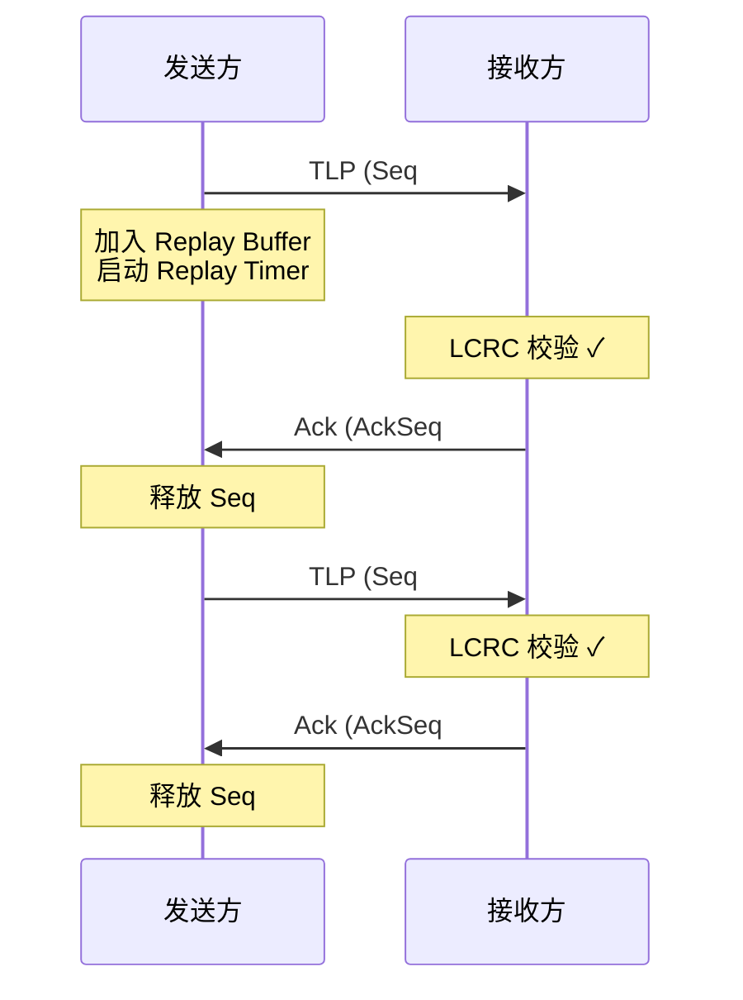
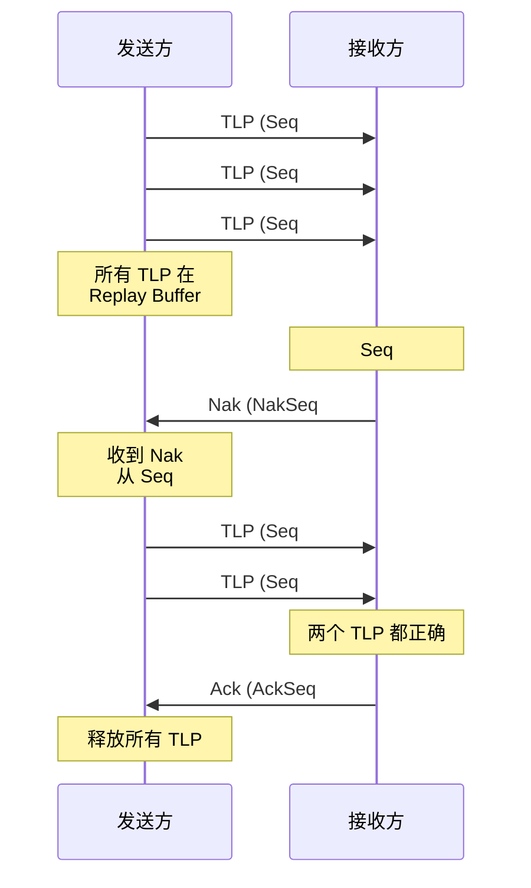
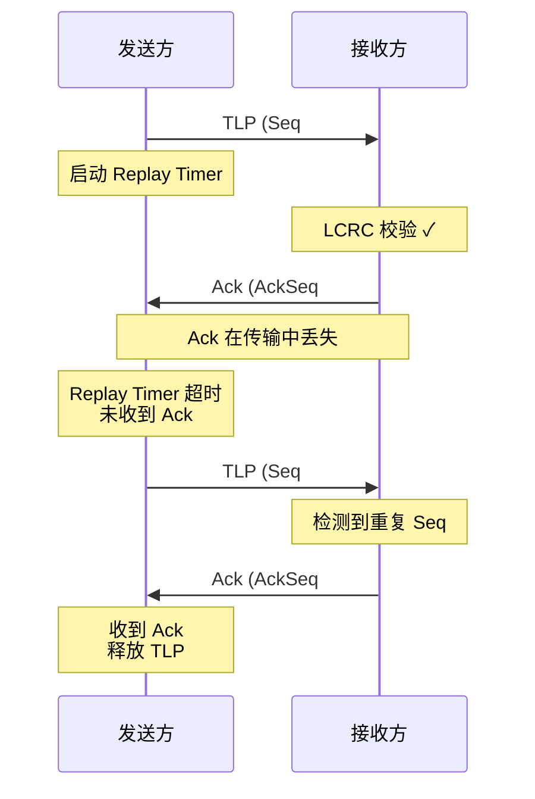

# ACK/NAK 协议详解

Data Link Layer 的 ACK/NAK 协议是 PCIe 可靠传输的核心机制，通过确认应答和重传机制确保 TLP 的可靠交付。

---

## 概述

**ACK/NAK 协议**是数据链路层实现可靠数据传输的关键技术，类似于 TCP 协议中的确认机制。

**核心功能**：
- **错误检测**：通过 LCRC (Link CRC) 检测传输错误
- **确认应答**：接收方发送 ACK DLLP 确认正确接收
- **请求重传**：检测到错误时发送 NAK DLLP 请求重传
- **序列号管理**：使用 12 位序列号跟踪和匹配 TLP
- **重传缓冲区**：发送方保存已发送但未确认的 TLP

**在协议栈中的位置**：
```
┌─────────────────────────────────────────┐
│  Transaction Layer                      │
│  生成 TLP                               │
└──────────────┬──────────────────────────┘
               │ TLP
┌──────────────▼──────────────────────────┐
│  Data Link Layer                        │
│  ┌─────────────────────────────────┐   │
│  │  ACK/NAK 协议                   │   │
│  │  • 添加 Seq# 和 LCRC            │   │
│  │  • 维护重传缓冲区               │   │
│  │  • 发送 ACK/NAK DLLP            │   │
│  └─────────────────────────────────┘   │
└──────────────┬──────────────────────────┘
               │ TLP + Seq# + LCRC
┌──────────────▼──────────────────────────┐
│  Physical Layer                         │
│  编码和传输                             │
└─────────────────────────────────────────┘
```

---

## ACK/NAK 协议原理

### DLLP 格式

**Data Link Layer Packet (DLLP)** 是数据链路层的控制包，用于链路管理，不包含数据负载。

**DLLP 基本结构**（8 字节）：
```
Byte 0-1: DLLP Type + Reserved
Byte 2-3: Type-Specific Data
Byte 4-5: Type-Specific Data (续)
Byte 6-7: CRC-16 (DLLP 校验)

┌──────────────┬──────────────┬──────────────┬──────────────┐
│  DLLP Type   │   Reserved   │  Seq Number  │  CRC-16      │
│  (8 bits)    │   (8 bits)   │  (varies)    │  (16 bits)   │
└──────────────┴──────────────┴──────────────┴──────────────┘
```

**ACK/NAK DLLP 类型**：

| DLLP Type | 二进制 | 功能 | 包含字段 |
|-----------|--------|------|----------|
| **Ack** | 0000_0000b | 确认接收 | AckSeq#: 已确认的序列号 |
| **Nak** | 0001_0000b | 请求重传 | NakSeq#: 需要重传的序列号 |

**Ack DLLP 格式**：
```
 0                   1                   2                   3
 0 1 2 3 4 5 6 7 8 9 0 1 2 3 4 5 6 7 8 9 0 1 2 3 4 5 6 7 8 9 0 1
┌───────────────┬───────────────┬───────────────────────────────┐
│  Type=0x00    │   Reserved    │      AckSeq# (12 bits)        │
│  (Ack DLLP)   │   (8 bits)    │      + Reserved (4 bits)      │
└───────────────┴───────────────┴───────────────┬───────────────┘
┌───────────────────────────────────────────────┴───────────────┐
│                    CRC-16                                      │
│                   (16 bits)                                    │
└────────────────────────────────────────────────────────────────┘

AckSeq#: 接收方期望的下一个 TLP 序列号 (已接收 AckSeq#-1)
```

**Nak DLLP 格式**：
```
 0                   1                   2                   3
 0 1 2 3 4 5 6 7 8 9 0 1 2 3 4 5 6 7 8 9 0 1 2 3 4 5 6 7 8 9 0 1
┌───────────────┬───────────────┬───────────────────────────────┐
│  Type=0x10    │   Reserved    │      NakSeq# (12 bits)        │
│  (Nak DLLP)   │   (8 bits)    │      + Reserved (4 bits)      │
└───────────────┴───────────────┴───────────────┬───────────────┘
┌───────────────────────────────────────────────┴───────────────┐
│                    CRC-16                                      │
│                   (16 bits)                                    │
└────────────────────────────────────────────────────────────────┘

NakSeq#: 需要重传的 TLP 序列号
```

### 序列号机制

**序列号（Sequence Number）** 用于标识和跟踪每个 TLP。

**关键特性**：
- **长度**：12 位（0-4095）
- **循环使用**：4096 后回绕到 0
- **作用域**：每个链路独立维护序列号空间
- **递增规则**：每发送一个 TLP，序列号加 1

**序列号在 TLP 中的位置**：
```
物理层添加的帧头：
┌─────────┬───────────┬─────────────┐
│  STP    │  Seq#     │  TLP Header │  ...
│ (Start) │ (12 bits) │   (3-4 DW)  │
└─────────┴───────────┴─────────────┘

STP (Start of TLP): 物理层帧定界符
Seq#: 数据链路层添加的序列号
```

**序列号比较**：
- PCIe 使用**模运算**比较序列号
- 允许回绕：Seq# 4095 的下一个是 Seq# 0

**示例**：
```
发送方发送 3 个 TLP：
  TLP1: Seq# = 100
  TLP2: Seq# = 101
  TLP3: Seq# = 102

接收方正确接收所有 TLP 后：
  发送 Ack DLLP: AckSeq# = 103 (期望接收 103)
```

### ACK 机制

**Ack 语义**：累积确认（Cumulative Acknowledgment）

**AckSeq# = N 的含义**：
- 接收方已成功接收所有序列号 **< N** 的 TLP
- 接收方期望接收序列号 **= N** 的 TLP

**Ack 发送时机**：
1. **周期性 Ack**：即使没有新 TLP，也定期发送 Ack 更新状态
2. **接收 TLP 后**：正确接收 TLP 并通过 LCRC 校验后发送
3. **Replay Timer 更新**：帮助发送方释放重传缓冲区

**示例场景**：
```
时间轴：
T0: 发送方发送 TLP(Seq#=10)
T1: 接收方接收，LCRC 正确
T2: 接收方发送 Ack(AckSeq#=11)
T3: 发送方接收 Ack，释放 TLP(Seq#=10) 的重传缓冲区
```

### NAK 机制

**Nak 语义**：选择性重传请求

**NakSeq# = N 的含义**：
- 接收方检测到序列号 **= N** 的 TLP 有错误（LCRC 失败）
- 或检测到序列号不连续（跳号）
- 请求发送方重传从 N 开始的所有 TLP

**Nak 发送时机**：
1. **LCRC 错误**：接收到 TLP 但 LCRC 校验失败
2. **序列号不连续**：接收到 Seq# = N+2，但未接收 Seq# = N+1
3. **TLP 格式错误**：Malformed TLP

**Nak 触发重传**：
- 发送方收到 Nak(NakSeq#=N) 后，从序列号 N 开始重传所有未确认的 TLP

**示例场景**：
```
时间轴：
T0: 发送方发送 TLP(Seq#=10), TLP(Seq#=11), TLP(Seq#=12)
T1: 接收方接收 TLP(Seq#=10) ✓
T2: 接收方接收 TLP(Seq#=11)，LCRC 错误 ✗
T3: 接收方发送 Nak(NakSeq#=11)
T4: 接收方接收 TLP(Seq#=12)，但序列号不连续，丢弃
T5: 发送方收到 Nak，重传 TLP(Seq#=11) 和 TLP(Seq#=12)
T6: 接收方正确接收重传的 TLP
T7: 接收方发送 Ack(AckSeq#=13)
```

---

## 可靠传输机制

### 重传缓冲区（Replay Buffer）

**作用**：发送方保存已发送但未确认的 TLP，以便在收到 NAK 时重传。

**缓冲区管理**：
```
发送方维护：
┌──────────────────────────────────────────────────┐
│  Replay Buffer (重传缓冲区)                      │
│                                                  │
│  [Seq#=10] [Seq#=11] [Seq#=12] [Seq#=13] ...   │
│     ↑                                            │
│     └─ AckSeq# (已确认，可释放之前的 TLP)        │
└──────────────────────────────────────────────────┘

缓冲区操作：
• 发送 TLP → 加入 Replay Buffer
• 收到 Ack(AckSeq#=N) → 释放所有 Seq# < N 的 TLP
• 收到 Nak(NakSeq#=N) → 从 Seq#=N 开始重传所有 TLP
```

**缓冲区大小**：
- 规范未强制规定大小
- 典型实现：足够容纳链路延迟期间发送的所有 TLP
- 过小：限制链路利用率
- 过大：浪费硬件资源

**缓冲区溢出**：
- 如果缓冲区满且未收到 Ack，发送方停止发送新 TLP
- 等待 Ack 释放缓冲区空间

### 超时机制

**Replay Timer（重传定时器）**：防止 Ack/Nak 丢失导致死锁。

**工作原理**：
```
发送方：
1. 发送 TLP 后启动 Replay Timer
2. 收到 Ack/Nak 后重置 Timer
3. Timer 超时 → 触发重传所有未确认的 TLP

┌─────────────────────────────────────────────────┐
│  Replay Timer 超时流程                          │
│                                                 │
│  发送 TLP → 启动 Timer                          │
│      │                                          │
│      ├─→ 收到 Ack → 重置 Timer                 │
│      │                                          │
│      └─→ 超时 (未收到 Ack) → 重传所有 TLP      │
│                                 └─→ 重启 Timer  │
└─────────────────────────────────────────────────┘
```

**超时时间**：
- **典型值**：根据链路速度和延迟动态计算
- **Gen 1/2**：约 300-400 纳秒
- **Gen 3+**：更短，适应更高速度

**超时计数器（Replay Number）**：
- 记录连续超时次数
- 如果超过阈值（如 4 次），认为链路故障
- 触发链路重新训练或错误报告

### 完整传输流程

**正常传输流程（无错误）**：


**错误重传流程**：


**超时重传流程**：


---

## FEMU 实现参考

### 数据链路层错误检测

```c
// hw/pci/pcie_aer.c - PCIe 高级错误报告
// LCRC 错误处理

// Data Link Protocol Error - LCRC 校验失败
#define PCI_ERR_UNC_DLP         0x00000010  // Bit 4

// 错误注入函数（用于测试）
void pcie_aer_inject_error(PCIDevice *dev, const PCIEAERErr *err)
{
    uint8_t *config = dev->config + dev->exp.aer_cap;
    
    if (err->flags & PCIE_AER_ERR_IS_CORRECTABLE) {
        // 可纠正错误（如 Bad TLP）
        pci_long_test_and_set_mask(config + PCI_ERR_COR_STATUS,
                                     err->status);
    } else {
        // 不可纠正错误（如 LCRC 错误）
        pci_long_test_and_set_mask(config + PCI_ERR_UNCOR_STATUS,
                                     err->status);
        
        // 记录错误详情
        if (err->status & PCI_ERR_UNC_DLP) {
            // Data Link Protocol Error (LCRC 失败)
            // 接收方应发送 NAK DLLP
        }
    }
}
```

### 重传缓冲区相关

```c
// hw/pci/pcie.c - PCIe 能力和链路管理

// 链路状态寄存器
#define PCI_EXP_LNKSTA_DLLLA    0x2000  // Data Link Layer Link Active

// 链路重新训练（链路故障后）
void pcie_cap_lnkctl_write(PCIDevice *dev, uint32_t old, uint32_t new)
{
    if (new & PCI_EXP_LNKCTL_RL) {
        // Retrain Link - 链路重新训练
        // 当重传失败次数过多时触发
        pcie_cap_deverr_reset(dev);
    }
}
```

### 错误计数器

```c
// include/standard-headers/linux/pci_regs.h

// AER 错误计数寄存器
#define PCI_ERR_CAP_ECRC_GENC   0x00000020  // ECRC Generation Capable
#define PCI_ERR_CAP_ECRC_GENE   0x00000040  // ECRC Generation Enable
#define PCI_ERR_CAP_ECRC_CHKC   0x00000080  // ECRC Check Capable
#define PCI_ERR_CAP_ECRC_CHKE   0x00000100  // ECRC Check Enable

// Replay Number 和 Replay Timer 超时会记录在这里：
#define PCI_ERR_COR_REP_ROLL    0x00000100  // Replay Num Rollover
#define PCI_ERR_COR_REP_TIMER   0x00001000  // Replay Timer Timeout
```

---

## 实际应用场景

### 场景 1：数据中心服务器

**环境**：高速 NVMe SSD (PCIe Gen 4 x4) 连接到 CPU

**挑战**：
- 高带宽 (16 GB/s) 对可靠性要求极高
- 任何数据损坏都可能导致文件系统错误

**ACK/NAK 作用**：
- LCRC 检测传输中的比特翻转
- NAK 触发立即重传，避免数据损坏
- Replay Buffer 大小优化以匹配链路延迟

**观测**：
```bash
# 查看 PCIe 错误统计
lspci -vvv -s 01:00.0 | grep -A 10 "Advanced Error Reporting"
    UESta:  DLP- SDES- TLP- FCP- CmpltTO- CmpltAbrt- UnxCmplt- RxOF- ...
    CEsta:  RxErr- BadTLP- BadDLLP- Rollover- Timeout- NonFatalErr-
    
# DLP (Data Link Protocol Error) = LCRC 错误导致 NAK
# Rollover = Replay Number 溢出（重传过多）
# Timeout = Replay Timer 超时
```

### 场景 2：热插拔设备

**环境**：热插拔 PCIe 设备（如 GPU）

**挑战**：
- 插入瞬间链路可能不稳定
- 需要重新建立可靠连接

**ACK/NAK 作用**：
- 链路训练完成后初始化序列号
- 初期可能有较多 NAK（链路质量建立中）
- Replay Timer 帮助检测连接是否稳定

### 场景 3：长距离 PCIe 扩展

**环境**：通过 PCIe 线缆或光纤扩展器连接设备

**挑战**：
- 信号衰减和噪声增加
- 链路延迟增大

**ACK/NAK 优化**：
- 增大 Replay Buffer 以适应更长的往返时间 (RTT)
- 调整 Replay Timer 超时时间
- 可能需要更频繁的 Ack 更新

---

## 实用技巧

### 调试 ACK/NAK 问题

**1. 查看 AER 错误统计**：
```bash
# 读取 AER 可纠正错误状态
setpci -s 01:00.0 ECAP_AER+0x10.L
# Bit 8: Replay Number Rollover
# Bit 12: Replay Timer Timeout

# 读取不可纠正错误状态
setpci -s 01:00.0 ECAP_AER+0x04.L
# Bit 4: Data Link Protocol Error (LCRC 错误)
```

**2. 使用 PCIe 协议分析仪**：
- 捕获 DLLP 流量
- 观察 Ack/Nak 模式
- 测量 Replay Timer 时间

**3. 内核日志**：
```bash
dmesg | grep -i "pcie.*error\|corrected\|uncorrected"
# 查找 PCIe 错误报告
```

### 性能优化

**1. 减少 NAK 触发**：
- 改善链路信号质量（更好的线缆、屏蔽）
- 降低环境噪声
- 检查 PCIe 插槽接触

**2. 优化 Replay Buffer**：
- 太小：限制带宽利用率
- 太大：浪费硬件资源
- 公式：`Buffer Size ≥ 链路带宽 × 往返时间`

**3. 监控错误率**：
```bash
# 持续监控错误计数
watch -n 1 'lspci -vvv -s 01:00.0 | grep -A 2 "CEsta\|UESta"'
```

### 故障排查流程

```
发现性能下降或错误
    ↓
检查 AER 错误状态
    ↓
┌─────────────────────┐
│ DLP 错误高？        │ → 是 → LCRC 问题（信号质量）
│ (Bit 4 UESta)       │         • 检查线缆和连接
└─────────────────────┘         • 降低链路速度测试
    ↓ 否
┌─────────────────────┐
│ Replay Timeout？    │ → 是 → Ack 未返回（链路阻塞）
│ (Bit 12 CEsta)      │         • 检查对端设备
└─────────────────────┘         • 检查链路训练状态
    ↓ 否
┌─────────────────────┐
│ Replay Rollover？   │ → 是 → 重传过多（持续错误）
│ (Bit 8 CEsta)       │         • 链路重新训练
└─────────────────────┘         • 可能硬件故障
```

---

## 总结

### 关键要点

1. ✅ **ACK/NAK 提供可靠传输**：通过确认和重传机制确保 TLP 正确交付
2. ✅ **序列号跟踪 TLP**：12 位序列号空间，循环使用
3. ✅ **累积确认**：Ack(AckSeq#=N) 表示已接收所有 Seq# < N 的 TLP
4. ✅ **选择性重传**：Nak(NakSeq#=N) 触发从 N 开始的重传
5. ✅ **Replay Buffer 必需**：发送方保存未确认的 TLP
6. ✅ **Replay Timer 防止死锁**：超时触发重传
7. ✅ **LCRC 检测错误**：Link CRC 是 NAK 的主要触发原因

### ACK/NAK vs 上层协议对比

| 特性 | ACK/NAK (数据链路层) | TCP (传输层) |
|------|---------------------|--------------|
| **作用范围** | 单个 PCIe 链路 | 端到端网络连接 |
| **序列号** | 12 位（循环） | 32 位 |
| **确认类型** | 累积确认 | 累积 + 选择性 |
| **重传单位** | TLP（数据包） | TCP Segment |
| **超时控制** | 硬件固定 | 动态调整 (RTT) |
| **透明性** | 对上层透明 | 应用层可见 |

---

## 下一步学习

- [DLLP 格式详解](dllp-format.md) - 完整的 DLLP 类型和格式
- [LCRC 计算](lcrc.md) - Link CRC 的计算方法
- [链路训练](../physical-layer/link-training.md) - LTSSM 状态机和初始化
- [流控制机制](flow-control.md) - 信用制流控制
- [TLP 格式](../transaction-layer/tlp-format.md) - 事务层包格式

---

## 参考资料

- **规范**：PCIe Base Spec Chapter 3 (Data Link Layer)
- **相关章节**：
  - Section 3.2: Data Link Control State Machine
  - Section 3.3: DLLP Processing
  - Section 3.4: Sequence Number Management
- **图表**：Figure 3-5 (ACK/NAK Protocol Flow)
- **实现**：`/hw/pci/pcie_aer.c` (FEMU)

---

**相关页面**：
- [← 数据链路层概述](README.md)
- [流控制初始化 →](flow-control-init.md)
- [返回首页](../README.md)

---

*最后更新：2026-07-06*
