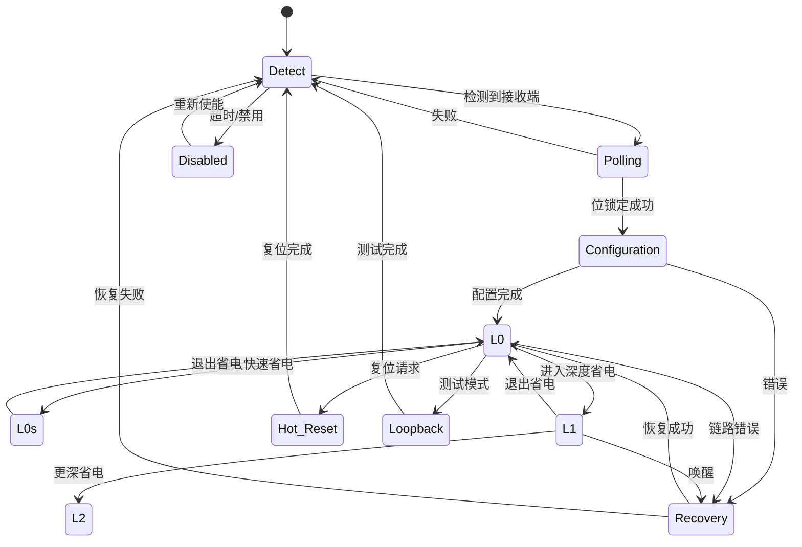

# LTSSM 状态机详解

Link Training and Status State Machine (LTSSM) 是 PCIe 物理层的核心状态机，负责链路初始化、训练、电源管理和错误恢复。

---

## 概述

LTSSM 是 PCIe 链路生命周期的控制中心，管理从设备上电到正常通信的整个过程。

**LTSSM 的核心职责**：
- **链路初始化**：检测对端设备并建立物理连接
- **速度协商**：确定最优的链路速度（2.5/5.0/8.0/16.0/32.0 GT/s）
- **宽度协商**：确定激活的 Lane 数量（x1/x2/x4/x8/x16/x32）
- **电源管理**：在不同功耗状态间切换
- **错误恢复**：检测并修复链路错误

**在协议栈中的位置**：
```
┌─────────────────────────────────────┐
│  Transaction Layer                  │
├─────────────────────────────────────┤
│  Data Link Layer                    │
├─────────────────────────────────────┤
│  Physical Layer - Logical           │
│  ┌──────────────────────────────┐   │
│  │     LTSSM 状态机             │◄──┼─ 控制链路行为
│  └──────────────────────────────┘   │
├─────────────────────────────────────┤
│  Physical Layer - Electrical        │  差分信号传输
└─────────────────────────────────────┘
```

---

## LTSSM 状态概览

LTSSM 定义了 11 个主要状态，每个状态有特定的功能和子状态。

### 状态分类

```
启动阶段：
  Detect → Polling → Configuration → L0

运行阶段：
  L0 (正常运行)
  
省电状态：
  L0s (快速省电) ← → L0
  L1 (深度省电) ← → L0
  L2 (更深省电)
  
维护状态：
  Recovery (错误恢复)
  Hot Reset (热复位)
  Loopback (环回测试)
  Disabled (禁用)
```

### LTSSM 状态转换图



---

## 主要状态详解

### 1. Detect（检测）

**目的**：检测链路对端是否存在设备

**行为**：
- 发送方驱动差分信号，检测接收端阻抗变化
- 如果检测到接收端（负载阻抗从高到低），进入 Polling
- 超时后保持在 Detect 或进入 Disabled

**子状态**：
- `Detect.Quiet`：静默期，准备检测
- `Detect.Active`：主动驱动信号并检测

**超时时间**：12 ms（典型值）

**实际应用**：
- 热插拔时，设备插入后进入此状态
- 系统启动时，Root Complex 扫描所有端口

### 2. Polling（轮询）

**目的**：建立位锁定和符号锁定，初步同步双方

**行为**：
- 发送训练序列（Training Sequence - TS1/TS2）
- 接收端尝试锁定比特流边界
- 双方交换链路和 Lane 信息

**子状态**：
- `Polling.Active`：发送 TS1 序列
- `Polling.Configuration`：发送 TS2 序列
- `Polling.Compliance`：合规性测试模式

**TS1/TS2 序列内容**：

| 字段 | 含义 |
|------|------|
| Link Number | 链路编号 |
| Lane Number | Lane 编号（用于去倾斜） |
| Data Rate | 支持的速度标识 |
| Training Control | 训练控制位 |

**关键点**：
- TS1：初始训练序列，建立比特锁定
- TS2：配置训练序列，准备进入 Configuration

### 3. Configuration（配置）

**目的**：协商链路宽度、速度和其他参数

**行为**：
- 确定激活的 Lane 数量（降宽或全宽）
- 配置 Lane 反转（Lane Reversal）
- 协商链路编号和扰码（Scrambling）
- 设置链路控制寄存器

**子状态**：
- `Configuration.Linkwidth.Start`：开始宽度协商
- `Configuration.Linkwidth.Accept`：接受宽度配置
- `Configuration.Lanenum.Accept`：接受 Lane 编号
- `Configuration.Complete`：配置完成
- `Configuration.Idle`：等待数据链路层初始化

**宽度协商示例**：

```
发送端支持：x16
接收端支持：x8
协商结果：  x8 (取较小值)

可能的宽度降级：
x16 → x8 → x4 → x2 → x1
```

**关键点**：
- **Lane 反转**：如果 PCB 布线反转，硬件自动检测并调整
- **去倾斜**：补偿不同 Lane 的传播延迟差异

### 4. L0（正常运行）

**目的**：链路完全激活，可以传输 TLP 和 DLLP

**行为**：
- 事务层可以发送和接收数据包
- 链路处于全功率状态
- 监控链路质量，必要时进入 Recovery

**性能指标**：

| 速度 (Gen) | 数据率 | 编码 | 有效带宽 (x16) |
|-----------|--------|------|---------------|
| Gen 1 | 2.5 GT/s | 8b/10b | 4 GB/s |
| Gen 2 | 5.0 GT/s | 8b/10b | 8 GB/s |
| Gen 3 | 8.0 GT/s | 128b/130b | 15.75 GB/s |
| Gen 4 | 16.0 GT/s | 128b/130b | 31.5 GB/s |
| Gen 5 | 32.0 GT/s | 128b/130b | 63 GB/s |

**退出条件**：
- 进入省电状态（L0s/L1）
- 发生链路错误（→ Recovery）
- 软件请求复位（→ Hot Reset）

### 5. L0s（快速省电）

**目的**：快速低功耗状态，适合短暂空闲

**特点**：
- **进入延迟**：< 1 μs
- **退出延迟**：< 1 μs
- **功耗节省**：20%-30%
- **独立方向**：TX 和 RX 可独立进入

**行为**：
- 停止发送数据，进入电气空闲（Electrical Idle）
- 保持 PLL 锁定，时钟不停止
- 快速恢复到 L0

**适用场景**：
- 突发流量的间隙
- DMA 传输的准备阶段
- 轻载应用（如网络适配器空闲时）

**配置示例**：
```c
// 启用 L0s（通过 ASPM 控制寄存器）
// Offset: PCIe Capability + 0x10 (Link Control)
pci_write_config_word(dev, cap + PCI_EXP_LNKCTL,
    PCI_EXP_LNKCTL_ASPM_L0S);  // Bit 0
```

### 6. L1（深度省电）

**目的**：更深的低功耗状态，适合较长空闲期

**特点**：
- **进入延迟**：2-4 μs
- **退出延迟**：2-4 μs
- **功耗节省**：50%-70%
- **双向同步**：TX 和 RX 必须同时进入

**行为**：
- 关闭 PLL，停止比特流
- 保持链路训练信息
- 需要通过 TS1 序列快速重训练恢复

**适用场景**：
- 设备长时间空闲（如存储设备无 IO）
- 移动设备节能模式
- 数据中心空闲服务器

**L1 子状态（PCIe 3.0+）**：

| 状态 | 退出延迟 | 功耗 | 说明 |
|------|---------|------|------|
| L1.0 | 2-4 μs | 中 | 标准 L1 |
| L1.1 | ~10 μs | 低 | PLL 关闭，保持参考时钟 |
| L1.2 | ~100 μs | 极低 | 主参考时钟关闭 |

### 7. L2（深度休眠）

**目的**：系统级低功耗状态（对应 ACPI S3/S4）

**特点**：
- 主电源可能关闭（仅保持辅助电源）
- 退出需要完整的链路重训练
- 通常与系统睡眠配合

**进入方式**：
- 软件通过电源管理接口请求
- 从 L1 接收 PM_Enter_L23 消息

**退出路径**：
```
L2 → L3 (准备状态) → Detect → Polling → Configuration → L0
```

### 8. Recovery（恢复）

**目的**：从链路错误中恢复，重新同步

**触发条件**：
- 比特错误率（BER）过高
- 接收到错误的 DLLP/TLP
- 超时事件
- 速度切换请求

**子状态**：
- `Recovery.RcvrLock`：重新建立接收锁定
- `Recovery.RcvrCfg`：重新配置接收端
- `Recovery.Idle`：等待链路空闲
- `Recovery.Speed`：速度切换

**速度切换示例**：
```
初始：Gen 3 (8.0 GT/s)
   ↓ 检测到链路不稳定
Recovery.Speed 阶段
   ↓ 降速到 Gen 2 (5.0 GT/s)
返回 L0 (更稳定的速度)
```

**实际应用**：
- **自动纠错**：临时信号干扰后自动恢复
- **速度优化**：根据链路质量动态调整速度
- **主动重训练**：软件触发链路重训练

### 9. Hot Reset（热复位）

**目的**：在不断电的情况下复位链路

**行为**：
- 发送热复位信号（持续 2 ms）
- 清除数据链路层状态
- 保持链路电源
- 重新进行完整训练

**使用场景**：
- 设备挂起后恢复
- 错误恢复失败
- 驱动重新加载

### 10. Loopback（环回）

**目的**：硬件测试和诊断

**模式**：
- **主环回**（Master Loopback）：发送端环回到接收端
- **从环回**（Slave Loopback）：接收端环回到发送端

**用途**：
- 制造测试
- 现场诊断
- 协议分析仪校准

### 11. Disabled（禁用）

**目的**：链路被软件或硬件禁用

**原因**：
- 软件显式禁用（写入链路控制寄存器）
- 多次初始化失败
- 硬件错误

**恢复**：
- 软件重新使能
- 系统复位

---

## ASPM（主动状态电源管理）

ASPM 是利用 LTSSM 的省电状态实现的节能机制。

### ASPM 状态转换

```
          无流量超时
L0 ───────────────────→ L0s
 ↑                        │
 │    有数据包需要发送      │
 └────────────────────────┘
 
          更长空闲
L0 ───────────────────→ L1
 ↑                       │
 │    唤醒事件/数据到达   │
 └───────────────────────┘
```

### ASPM 配置

**Linux 内核代码示例**：

```c
// drivers/pci/pcie/aspm.c
static void pcie_config_aspm_link(struct pcie_link_state *link, u32 state)
{
    u32 reg_val = 0;
    
    // L0s 使能
    if (state & ASPM_STATE_L0S)
        reg_val |= PCI_EXP_LNKCTL_ASPM_L0S;
    
    // L1 使能
    if (state & ASPM_STATE_L1)
        reg_val |= PCI_EXP_LNKCTL_ASPM_L1;
    
    // 写入链路控制寄存器
    pcie_capability_write_word(link->pdev, PCI_EXP_LNKCTL, reg_val);
}
```

### ASPM 性能权衡

| 策略 | 延迟 | 节能效果 | 适用场景 |
|------|------|---------|---------|
| 禁用 ASPM | 最低 | 无节能 | 高性能计算、实时系统 |
| 仅 L0s | 低 | 20-30% | 平衡性能和节能 |
| L0s + L1 | 中 | 50-70% | 移动设备、轻载服务器 |
| L1 子状态 | 高 | 70-90% | 极低功耗需求 |

---

## FEMU 代码中的 LTSSM 实现

虽然 FEMU 作为虚拟环境不完全模拟物理层，但保留了关键的链路管理接口。

### 链路能力设置

```c
// hw/pci/pcie.c
void pcie_cap_fill_link_ep_usp(PCIDevice *dev, uint8_t offset,
                                uint8_t max_link_speed,
                                uint8_t max_link_width)
{
    uint32_t lnkcap = 0;
    
    // 设置最大链路速度
    lnkcap |= (max_link_speed & PCI_EXP_LNKCAP_SLS);
    
    // 设置最大链路宽度
    lnkcap |= (max_link_width << PCI_EXP_LNKCAP_MLW_SHIFT);
    
    // 写入链路能力寄存器
    pci_set_long(dev->config + offset + PCI_EXP_LNKCAP, lnkcap);
    
    // 设置链路状态（模拟已训练完成）
    uint16_t lnksta = 0;
    lnksta |= (max_link_speed << PCI_EXP_LNKSTA_CLS_SHIFT);
    lnksta |= (max_link_width << PCI_EXP_LNKSTA_NLW_SHIFT);
    lnksta |= PCI_EXP_LNKSTA_DLLLA;  // Data Link Layer Active
    pci_set_word(dev->config + offset + PCI_EXP_LNKSTA, lnksta);
}
```

### ASPM 状态读取

```c
// hw/pci/pcie.c
uint8_t pcie_cap_get_aspm_state(PCIDevice *dev)
{
    uint32_t pos = pci_find_capability(dev, PCI_CAP_ID_EXP);
    if (!pos) {
        return 0;
    }
    
    uint16_t lnkctl = pci_get_word(dev->config + pos + PCI_EXP_LNKCTL);
    return lnkctl & PCI_EXP_LNKCTL_ASPMC;  // ASPM Control bits
}
```

### Linux 内核链路重训练

```c
// drivers/pci/pcie/portdrv_pci.c
int pcie_retrain_link(struct pci_dev *pdev)
{
    u16 lnkctl;
    
    // 读取链路控制寄存器
    pcie_capability_read_word(pdev, PCI_EXP_LNKCTL, &lnkctl);
    
    // 设置重训练位（触发 Recovery）
    lnkctl |= PCI_EXP_LNKCTL_RL;
    pcie_capability_write_word(pdev, PCI_EXP_LNKCTL, lnkctl);
    
    // 等待训练完成
    return pcie_wait_for_link_training(pdev);
}
```

---

## 实用技巧

### 1. 查看链路状态

**使用 lspci 查看当前链路状态**：

```bash
# 查看链路速度和宽度
lspci -vvv -s 01:00.0 | grep -i "lnk"

输出示例：
    LnkCap: Port #0, Speed 8GT/s, Width x4, ASPM L0s L1
    LnkCtl: ASPM L1 Enabled; RCB 64 bytes
    LnkSta: Speed 8GT/s (ok), Width x4 (ok)
```

**解读**：
- `LnkCap`：设备支持的最大能力
- `LnkCtl`：当前配置的控制参数
- `LnkSta`：当前实际链路状态

### 2. 调试链路训练问题

**常见问题和解决方案**：

| 现象 | 可能原因 | 调试方法 |
|------|---------|---------|
| 链路无法建立 | 硬件连接问题 | 检查 Detect 状态，测量信号完整性 |
| 速度低于预期 | 信号质量差 | 查看 Recovery 次数，尝试降低插槽位置 |
| 宽度降级 | Lane 失败 | 检查 Lane Error Status 寄存器 |
| 频繁 Recovery | 时钟抖动/干扰 | 检查 BER，改善屏蔽和电源 |

**查看 PCIe 错误计数**：

```bash
# 使用 pcieport 驱动的 AER 统计
cat /sys/bus/pci/devices/0000:01:00.0/aer_dev_correctable
cat /sys/bus/pci/devices/0000:01:00.0/aer_dev_fatal
```

### 3. 优化 ASPM 配置

**性能敏感场景**（如 NVMe SSD）：

```bash
# 禁用 ASPM 以获得最低延迟
setpci -s 01:00.0 CAP_EXP+10.w=0x0000

# 或在内核启动参数中
pcie_aspm=off
```

**节能场景**（如笔记本电脑）：

```bash
# 启用全部 ASPM 状态
echo powersave > /sys/module/pcie_aspm/parameters/policy
```

### 4. 手动触发链路重训练

**使用 setpci 触发重训练**：

```bash
# 读取当前链路控制
setpci -s 01:00.0 CAP_EXP+10.w

# 设置重训练位（Bit 5）
setpci -s 01:00.0 CAP_EXP+10.w=0x0020

# 注意：重训练会短暂中断链路（<100ms）
```

### 5. 监控链路稳定性

**实时监控脚本**：

```bash
#!/bin/bash
# 监控 PCIe 链路状态
DEV="01:00.0"
while true; do
    lspci -vvv -s $DEV | grep -E "LnkSta|CESta|UESta"
    sleep 1
done
```

---

## 实际应用场景

### 场景 1：NVMe SSD 热插拔

```
1. 用户插入 NVMe 设备
   → LTSSM: Detect (检测到设备)
   
2. 链路初始化
   → LTSSM: Polling (建立比特锁定)
   → LTSSM: Configuration (协商 x4, Gen3)
   
3. 链路激活
   → LTSSM: L0 (开始数据传输)
   
4. 操作系统枚举设备
   → 加载 NVMe 驱动
   → 挂载文件系统
```

### 场景 2：笔记本电脑进入睡眠

```
1. 用户合上笔记本盖子
   → 操作系统准备进入 S3 睡眠
   
2. 设备驱动保存状态
   → 发送 PM_Turn_Off 消息
   
3. PCIe 设备进入低功耗
   → LTSSM: L0 → L1 → L2
   
4. 系统进入睡眠
   → 主电源关闭，辅助电源保持
```

### 场景 3：高速网卡间歇性丢包

```
问题：网卡间歇性丢包，延迟抖动

诊断：
1. 检查 ASPM 状态
   → 发现 L0s 启用，频繁进入/退出
   
2. 测量退出延迟
   → L0s 退出需要 800ns，影响低延迟流量
   
解决：
3. 禁用 ASPM
   → 性能恢复正常，延迟稳定
```

### 场景 4：GPU 训练失败

```
问题：高端 GPU 无法初始化到 Gen4 x16

诊断：
1. 查看链路状态
   → 实际：Gen3 x16（低于预期 Gen4）
   
2. 检查主板 BIOS
   → PCIe 插槽配置为 Gen3 最大
   
3. 更新 BIOS
   → 启用 Gen4 支持
   
结果：
4. 重新训练
   → LTSSM: Recovery.Speed
   → 成功协商到 Gen4 x16
```

---

## 总结

### 关键要点

1. ✅ **LTSSM 是 PCIe 链路的生命周期管理者**，从检测到正常运行的全流程
2. ✅ **11 个主要状态**涵盖初始化、运行、省电、恢复
3. ✅ **Detect → Polling → Configuration → L0** 是标准启动序列
4. ✅ **L0s 和 L1** 是 ASPM 的核心省电状态
5. ✅ **Recovery 状态**提供错误恢复和速度切换能力
6. ✅ **理解 LTSSM** 对诊断链路问题、优化性能至关重要

### LTSSM 与其他层的关系

```
LTSSM (Physical Layer)
  ↓ 提供稳定的物理链路
Data Link Layer
  ↓ 提供可靠的包传输
Transaction Layer
  ↓ 提供事务语义
Software / Driver
```

---

## 下一步学习

- [链路速度与编码](link-speed-encoding.md) - 8b/10b 和 128b/130b 编码详解
- [训练序列详解](training-sequences.md) - TS1/TS2 格式和功能
- [电源管理](../power-management/aspm.md) - ASPM 深度剖析
- [错误恢复机制](error-recovery.md) - Recovery 状态的详细流程
- [物理层概览](overview.md) - Physical Layer 整体架构

---

## 参考资料

- **规范**：PCIe Base Spec Chapter 4 (Physical Layer Logical)
- **图表**：Figure 4-12 to 4-14 (LTSSM 状态图)
- **表格**：Table 4-14 (状态转换条件)
- **实现**：`/hw/pci/pcie.c` (FEMU)
- **Linux**：`drivers/pci/pcie/aspm.c` (内核 ASPM 实现)

---

**相关页面**：
- [← 物理层概览](overview.md)
- [链路速度与编码 →](link-speed-encoding.md)
- [返回首页](../README.md)

---

*最后更新：2026-07-06*
