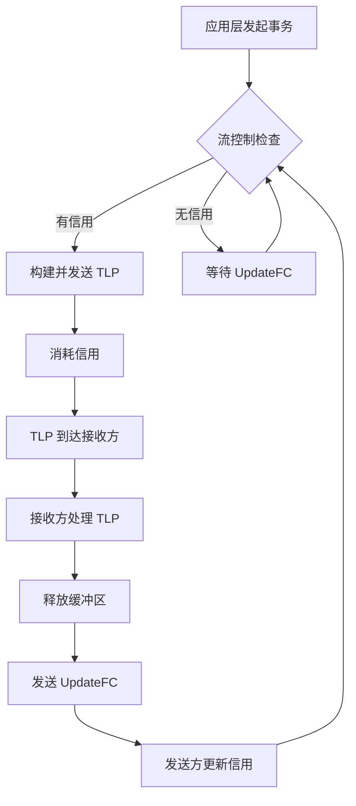

# 流控制机制 (Flow Control)

PCIe 流控制是一种基于信用 (Credit) 的机制，用于防止发送方发送超过接收方缓冲区容量的数据，确保链路上的数据传输高效且无丢失。

---

## 概述

流控制 (Flow Control, FC) 是 PCIe **事务层**的关键功能，通过**数据链路层** (DLLP) 进行信用信息交换。

**核心思想**：
- 接收方广播 (Advertise) 其可用的缓冲区空间（以信用形式）
- 发送方在发送 TLP 前检查并消耗相应信用
- 接收方处理完 TLP 后返还信用
- **无信用 = 不能发送**，防止缓冲区溢出

**流控制的特点**：
```
┌──────────────────────────────────────────────┐
│  流控制是点对点的 (Point-to-Point)            │
│  仅在单个 Link 的两端进行                     │
│  不是端到端的 (End-to-End)                    │
└──────────────────────────────────────────────┘

     Device A                    Device B
  ┌───────────┐                ┌───────────┐
  │  TX Logic │◄───── FC ──────┤  RX Logic │
  │           │                │ (Buffer)  │
  └───────────┘                └───────────┘
       ▲                            │
       │                            ▼
  消耗信用发送 TLP          接收并处理 TLP
       ▲                            │
       │                            ▼
       └────────── 返还信用 ────────┘
```

**与数据完整性机制的关系**：
- 流控制假定 TLP 传输是完美的
- 数据链路层的 ACK/NAK 和重传机制保证可靠性
- 流控制机制不感知重传（重传的 TLP 不重复消耗信用）

---

## 流控制分类

### 三种 TLP 类型

PCIe 流控制区分三种 TLP 类型，对应不同的缓冲区和信用池：

| TLP 类型 | 英文 | 包含的 TLP | 特点 |
|---------|------|-----------|------|
| **Posted (P)** | Posted Request | Memory Write, Message | 无需 Completion 响应，单向传输 |
| **Non-Posted (NP)** | Non-Posted Request | Memory Read, I/O R/W, Config R/W, AtomicOp | 需要 Completion 响应 |
| **Completion (Cpl)** | Completion | Completion, Completion with Data | 对 NP 请求的响应 |

**为什么要分类？**
- **Posted** 和 **Non-Posted** 必须分离，防止死锁
  - 如果共用缓冲区，NP 的 Completion 可能被 Posted 请求阻塞
- **Completion** 独立管理，确保 NP 请求总能得到响应

### 两种信用维度

每种 TLP 类型进一步区分**头部**和**数据**信用：

| 信用类型 | 说明 | 信用单位 |
|---------|------|---------|
| **Header Credit (HDR)** | TLP 头部数量 | 1 个最大头部 + TLP Digest (ECRC) |
| **Data Credit (DATA)** | 数据负载大小 | 4 DW (16 字节) |

### 六种信用类型

每个**虚拟通道 (Virtual Channel)** 独立维护 6 种信用：

```
┌─────────────────────────────────────────────┐
│           Virtual Channel (VC0)             │
├─────────────────────────────────────────────┤
│  PH   (Posted Header)                       │
│  PD   (Posted Data)                         │
├─────────────────────────────────────────────┤
│  NPH  (Non-Posted Header)                   │
│  NPD  (Non-Posted Data)                     │
├─────────────────────────────────────────────┤
│  CplH (Completion Header)                   │
│  CplD (Completion Data)                     │
└─────────────────────────────────────────────┘
```

**完整的信用类型表 (Table 2-42)**：

| 信用类型 | 适用于 |
|---------|--------|
| **PH** | Posted Request 头部 |
| **PD** | Posted Request 数据负载 |
| **NPH** | Non-Posted Request 头部 |
| **NPD** | Non-Posted Request 数据负载 |
| **CplH** | Completion 头部 |
| **CplD** | Completion 数据负载 |

---

## TLP 信用消耗规则

不同类型的 TLP 消耗不同的信用组合 (Table 2-43)：

| TLP 类型 | 消耗的信用 | 说明 |
|---------|-----------|------|
| **Memory Read Request** | 1 NPH | 只有头部，无数据 |
| **Memory Write Request** | 1 PH + n PD | n = Roundup(Length / 4 DW) |
| **I/O Write Request** | 1 NPH + 1 NPD | I/O 写最多 1 DW |
| **Config Write Request** | 1 NPH + 1 NPD | Config 写最多 1 DW |
| **AtomicOp Request** | 1 NPH + n NPD | n 根据原子操作类型 |
| **Message (无数据)** | 1 PH | 如 INTx 中断 |
| **Message (带数据)** | 1 PH + n PD | 如错误报告消息 |
| **Completion (无数据)** | 1 CplH | I/O Write 的响应 |
| **Completion (带数据)** | 1 CplH + n CplD | Memory Read 的响应 |
| **AtomicOp Completion** | 1 CplH + 1 CplD | 最多 4 DW 数据 |

**信用计算示例**：
```
示例 1: Memory Write Request, 128 字节数据
  - 头部: 1 PH
  - 数据: 128 字节 / 16 字节 = 8 PD
  - 总计: 1 PH + 8 PD

示例 2: Memory Read Request, 256 字节
  - 头部: 1 NPH (请求时不携带数据)
  - 完成时: 1 CplH + 16 CplD (256 / 16 = 16)

示例 3: Config Read Request
  - 请求: 1 NPH
  - 完成: 1 CplH + 1 CplD (4 字节)
```

---

## 流控制初始化

### 初始化时机

**VC0 (默认虚拟通道)**：
- 在数据链路层进入 `DL_Init` 状态时自动初始化
- 硬件自动完成，无需软件干预

**其他 VC (VC1-VC7)**：
- 软件通过设置两端设备的 `VC Enable` 位来启用
- 每个新启用的 VC 独立执行流控制初始化协议

### 初始化协议

使用两种特殊的 DLLP 进行初始化：

```
┌──────────────────────────────────────────────┐
│         Flow Control Initialization          │
└──────────────────────────────────────────────┘

  Device A (接收方)              Device B (接收方)
       │                              │
       ├──── InitFC1 (VC0, Credits) ──┤
       │                              │
       ├──── InitFC1 (VC0, Credits) ──┤
       │                              │
       ├──── InitFC2 (VC0, Credits) ──┤
       │                              │
       ├──── InitFC2 (VC0, Credits) ──┤
       │                              │
       └──────── 初始化完成 ───────────┘
                可以发送 TLP
```

**DLLP 类型**：
- **InitFC1**：第一阶段初始化，广播初始信用
- **InitFC2**：第二阶段初始化，确认信用接收
- **UpdateFC**：运行时信用更新

### 最小初始信用

接收方在初始化时必须广播的最小信用值 (Table 2-44)：

**无缩放或缩放因子 = 1**：

| 信用类型 | 最小值 | 说明 |
|---------|-------|------|
| **PH** | 1 单位 (01h) | 至少 1 个 Posted 头部 |
| **PD** | Max_Payload_Size / 16 字节 | 例如 128 字节 → 8 单位 |
| **NPH** | 1 单位 (01h) | 至少 1 个 Non-Posted 头部 |
| **NPD** | 1 单位 (01h) | 至少 1 个 DW (4 字节) |
| **CplH** | 1 单位 (01h) | 至少 1 个 Completion 头部 |
| **CplD** | Max_Read_Request_Size / 16 字节 | 例如 512 字节 → 32 单位 |

**示例**：
```
设备配置:
  Max_Payload_Size = 256 字节
  Max_Read_Request_Size = 512 字节

初始信用广播:
  PH  = 1 单位
  PD  = 256 / 16 = 16 单位
  NPH = 1 单位
  NPD = 1 单位
  CplH = 1 单位
  CplD = 512 / 16 = 32 单位
```

---

## 流控制运行机制

### 发送方逻辑

```
发送 TLP 前检查流控制:

1. 计算所需信用
   ├─> 头部: 1 HDR
   └─> 数据: Roundup(Length / 4 DW)

2. 检查可用信用
   ├─> 信用充足 → 继续
   └─> 信用不足 → 等待 UpdateFC

3. 消耗信用
   ├─> 从本地信用计数器扣除
   └─> 将 TLP 传递给数据链路层

4. 传输后不立即返还
   └─> 等待对端返还信用
```

### 接收方逻辑

```
接收并处理 TLP:

1. 接收 TLP (从数据链路层)
   └─> 放入对应 VC 的缓冲区

2. 处理 TLP
   ├─> 解析头部
   ├─> 执行事务（读/写内存等）
   └─> 释放缓冲区空间

3. 返还信用
   ├─> 发送 UpdateFC DLLP
   ├─> 广播可用信用数量
   └─> 对端更新其信用计数器
```

### 信用更新 (UpdateFC)

**UpdateFC DLLP 格式**：
```
┌─────────────────────────────────────────┐
│  Type = UpdateFC_P / UpdateFC_NP / ...  │
├─────────────────────────────────────────┤
│  VC ID (3 bits)                         │
├─────────────────────────────────────────┤
│  HdrFC (8 bits) - 头部信用              │
├─────────────────────────────────────────┤
│  DataFC (12 bits) - 数据信用            │
└─────────────────────────────────────────┘
```

**更新策略**：
- 定期发送 UpdateFC（即使信用未变化）
- 信用变化时立即发送 UpdateFC
- 接收方自主决定更新频率

---

## 流控制示例场景

### 场景 1: 大块 Memory Write

```
设备 A → 设备 B: 写入 1024 字节到内存

初始状态:
  设备 A 的信用视图 (设备 B 的缓冲区):
    PH = 10, PD = 256 (4096 字节)

步骤 1: 发送第一个 Memory Write (256 字节)
  消耗: 1 PH + 16 PD
  剩余: 9 PH, 240 PD

步骤 2: 发送第二个 Memory Write (256 字节)
  消耗: 1 PH + 16 PD
  剩余: 8 PH, 224 PD

步骤 3: 发送第三个 Memory Write (256 字节)
  消耗: 1 PH + 16 PD
  剩余: 7 PH, 208 PD

步骤 4: 发送第四个 Memory Write (256 字节)
  消耗: 1 PH + 16 PD
  剩余: 6 PH, 192 PD  ← 1024 字节全部发送完成

设备 B 处理完成后:
  ← UpdateFC: PH = 10, PD = 256 (返还全部信用)
```

### 场景 2: Memory Read 请求和响应

```
设备 A → 设备 B: 读取 512 字节

初始状态:
  设备 A 信用视图:
    NPH = 5, NPD = 10 (设备 B 的 NP 缓冲区)
    CplH = 8, CplD = 64 (设备 A 的 Cpl 缓冲区，接收响应)

步骤 1: 设备 A 发送 Memory Read Request
  消耗: 1 NPH
  剩余: 4 NPH, 10 NPD

步骤 2: 设备 B 接收并处理请求
  ← UpdateFC_NP: NPH = 5, NPD = 10 (返还 NP 信用)

步骤 3: 设备 B 发送 Completion with Data (512 字节)
  (设备 B 检查设备 A 的 Cpl 信用)
  消耗: 1 CplH + 32 CplD
  设备 A 剩余: 7 CplH, 32 CplD

步骤 4: 设备 A 接收并处理 Completion
  → UpdateFC_Cpl: CplH = 8, CplD = 64 (返还 Cpl 信用)
```

### 场景 3: 信用耗尽和等待

```
设备 A 尝试连续发送大量 Memory Write:

初始状态: PH = 3, PD = 16

发送 1: Memory Write 64 字节 (1 PH + 4 PD)
  剩余: 2 PH, 12 PD ✓

发送 2: Memory Write 64 字节 (1 PH + 4 PD)
  剩余: 1 PH, 8 PD ✓

发送 3: Memory Write 64 字节 (1 PH + 4 PD)
  剩余: 0 PH, 4 PD ✓

发送 4: Memory Write 64 字节 (1 PH + 4 PD)
  需要: 1 PH, 但 PH = 0 ✗
  → 等待 UpdateFC_P

(设备 B 处理完部分 TLP)
  ← UpdateFC_P: PH = 2, PD = 24

发送 4: 继续
  剩余: 1 PH, 20 PD ✓
```

---

## FEMU 代码实现参考

### 流控制相关数据结构

虽然 FEMU 作为虚拟化平台简化了流控制实现（虚拟链路无缓冲区限制），但在真实硬件或完整模拟中，会维护类似结构：

```c
// 概念性的流控制信用跟踪（实际 FEMU 简化处理）
typedef struct PCIeFlowControl {
    uint8_t  vc_id;              // Virtual Channel ID
    
    // 发送方视图：对端的可用信用
    uint16_t ph_credits;         // Posted Header
    uint16_t pd_credits;         // Posted Data
    uint16_t nph_credits;        // Non-Posted Header
    uint16_t npd_credits;        // Non-Posted Data
    uint16_t cplh_credits;       // Completion Header
    uint16_t cpld_credits;       // Completion Data
    
    // 接收方视图：本地的缓冲区信息
    uint16_t ph_buffer_size;     // 本地 Posted 缓冲区
    uint16_t pd_buffer_size;
    // ... 其他缓冲区
} PCIeFlowControl;
```

### TLP 发送时的信用检查

```c
// 伪代码：发送 TLP 前检查流控制
bool pcie_check_flow_control(PCIDevice *dev, TLP *tlp)
{
    PCIeFlowControl *fc = &dev->fc[tlp->vc_id];
    
    // 计算所需信用
    uint16_t hdr_needed = 1;
    uint16_t data_needed = (tlp->length + 3) / 4; // Roundup to DW
    
    // 根据 TLP 类型检查相应信用池
    if (tlp->type == TLP_MEMORY_WRITE) {
        // Posted Request
        if (fc->ph_credits < hdr_needed || 
            fc->pd_credits < data_needed) {
            return false; // 信用不足，等待
        }
        // 消耗信用
        fc->ph_credits -= hdr_needed;
        fc->pd_credits -= data_needed;
    }
    else if (tlp->type == TLP_MEMORY_READ) {
        // Non-Posted Request
        if (fc->nph_credits < hdr_needed) {
            return false;
        }
        fc->nph_credits -= hdr_needed;
    }
    // ... 其他类型
    
    return true; // 可以发送
}
```

### UpdateFC DLLP 处理

```c
// 伪代码：处理 UpdateFC DLLP
void pcie_handle_updatefc_dllp(PCIDevice *dev, DLLP *dllp)
{
    uint8_t vc_id = dllp->vc_id;
    PCIeFlowControl *fc = &dev->fc[vc_id];
    
    // 更新对端广播的信用值
    switch (dllp->type) {
    case DLLP_UPDATEFC_P:
        fc->ph_credits = dllp->hdr_fc;
        fc->pd_credits = dllp->data_fc;
        break;
    case DLLP_UPDATEFC_NP:
        fc->nph_credits = dllp->hdr_fc;
        fc->npd_credits = dllp->data_fc;
        break;
    case DLLP_UPDATEFC_CPL:
        fc->cplh_credits = dllp->hdr_fc;
        fc->cpld_credits = dllp->data_fc;
        break;
    }
    
    // 唤醒等待信用的发送队列
    pcie_wakeup_tx_queue(dev, vc_id);
}
```

### Linux Kernel 中的流控制

实际的 PCIe 硬件由控制器芯片管理流控制，驱动程序通常不需要直接操作。但可以通过配置空间观察相关参数：

```c
// 读取设备的 Max Payload Size (影响 PD 信用需求)
int pos = pci_find_capability(pdev, PCI_CAP_ID_EXP);
u16 devctl;
pci_read_config_word(pdev, pos + PCI_EXP_DEVCTL, &devctl);

int max_payload = 128 << ((devctl & PCI_EXP_DEVCTL_PAYLOAD) >> 5);
// max_payload: 128, 256, 512, 1024, 2048, 4096 字节

// 读取 Max Read Request Size (影响 CplD 信用需求)
int max_read = 128 << ((devctl & PCI_EXP_DEVCTL_READRQ) >> 12);
```

---

## 实用技巧

### 性能优化

**1. 增大缓冲区和信用**
- 更多信用 = 更多并发 TLP
- 减少因信用耗尽而等待的情况
- 权衡：缓冲区消耗芯片资源

**2. 调整 Max Payload Size**
```bash
# 查看当前设置
lspci -vvv -s 01:00.0 | grep MaxPayload
  MaxPayload 256 bytes, MaxReadReq 512 bytes

# 增大 Max Payload (需要内核支持)
setpci -s 01:00.0 68.w=5000  # 设置为 256 字节
```
- 更大的 Payload → 每个 TLP 携带更多数据
- 减少 TLP 数量和头部开销
- 注意：整个路径上的所有设备必须支持

**3. 使用多个 Virtual Channel**
- VC0-VC7 独立的信用池
- 不同优先级的流量隔离
- 高优先级流量不被低优先级阻塞

### 调试流控制问题

**症状：性能低下或死锁**

**可能原因**：
1. 信用配置过小
2. 信用返还延迟过高
3. Posted 和 Non-Posted 缓冲区分配不当

**调试方法**：
```bash
# 使用 PCIe 协议分析仪
# 捕获 UpdateFC DLLP，观察信用值变化

# 软件层面：检查设备配置
lspci -vvv -s 01:00.0 | grep -E "MaxPayload|MaxReadReq|LnkSta"
  MaxPayload 256 bytes, MaxReadReq 512 bytes
  LnkSta: Speed 8GT/s, Width x4

# 检查错误计数器
lspci -vvv -s 01:00.0 | grep -A 20 "Advanced Error Reporting"
```

**常见问题**：
- **Flow Control Protocol Error (FCP)**：信用计算错误
- **Completion Timeout**：NP 请求未得到响应（可能因 Cpl 缓冲区满）

### 避免死锁

**死锁场景**：
```
设备 A                        设备 B
  │                              │
  ├───── Memory Read ───────────►│
  │      (消耗 NPH)              │
  │                              │ NP 缓冲区满
  │                              │ 无法接收
  │                              │
  │◄──── Memory Write ───────────┤
  │      (Posted)                │
  │ Posted 缓冲区满              │
  │ 无法接收                      │
  ▼                              ▼
死锁：双方都在等待对方处理
```

**解决方案**：
1. **分离 Posted 和 Non-Posted 缓冲区**
   - PCIe 规范强制要求
   - 确保 NP 和 Completion 总有空间

2. **保证最小缓冲区**
   - 至少 1 个 NPH 和 1 个 CplH
   - 确保请求-响应链路不会完全阻塞

3. **正确处理排序规则**
   - Posted 不能阻塞 Non-Posted
   - Completion 优先处理

---

## 总结

### 关键要点

1. ✅ **流控制是基于信用的**：发送前检查，发送后消耗，处理后返还
2. ✅ **三种 TLP 类型独立管理**：Posted, Non-Posted, Completion
3. ✅ **六种信用类型**：每种 TLP 类型区分 Header 和 Data
4. ✅ **流控制是点对点的**：仅在单个 Link 两端，不是端到端
5. ✅ **使用 DLLP 交换信用**：InitFC1/InitFC2 初始化, UpdateFC 运行时更新
6. ✅ **每个 VC 独立流控制**：VC0-VC7 各有独立信用池
7. ✅ **最小信用要求**：防止死锁，确保基本通信

### 流控制在 PCIe 中的作用



**流控制保证了**：
- 接收方缓冲区不会溢出
- 发送方和接收方同步缓冲区状态
- 链路带宽高效利用（避免丢包和重传）
- 与排序规则配合，防止死锁

---

## 下一步学习

- [TLP 格式详解](tlp-format.md) - 理解 TLP 结构和信用计算
- [DLLP 格式](../data-link-layer/dllp-format.md) - InitFC 和 UpdateFC DLLP 的详细格式
- [排序规则](ordering.md) - 流控制与排序规则的关系
- [虚拟通道](virtual-channels.md) - VC 的配置和流控制隔离
- [性能优化](../best-practices/performance.md) - 流控制相关的性能调优

---

## 参考资料

- **PCIe 规范**：Base Spec Revision 5.0, Chapter 2.6 (Flow Control)
- **关键表格**：
  - Table 2-42: Flow Control Credit Types
  - Table 2-43: TLP Flow Control Credit Consumption
  - Table 2-44: Minimum Initial Flow Control Advertisements
- **关键章节**：
  - Section 3.4: Flow Control Initialization Protocol (Data Link Layer)
  - Section 3.5: Flow Control DLLPs
  - Appendix H: Flow Control Update Latency Calculations
- **FEMU 代码**：`/hw/pci/pcie.c`, `/hw/pci/pcie_aer.c`

---

**相关页面**：
- [← 三层协议模型](../architecture/layering.md)
- [TLP 格式 →](tlp-format.md)
- [返回首页](../README.md)

---

*最后更新：2026-07-06*
