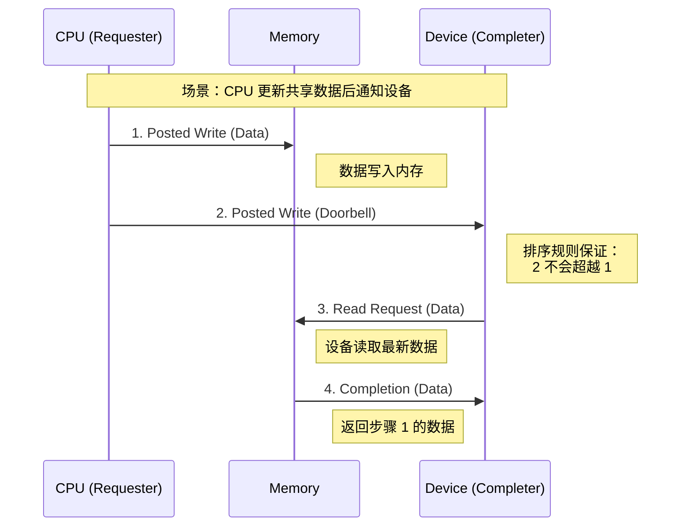
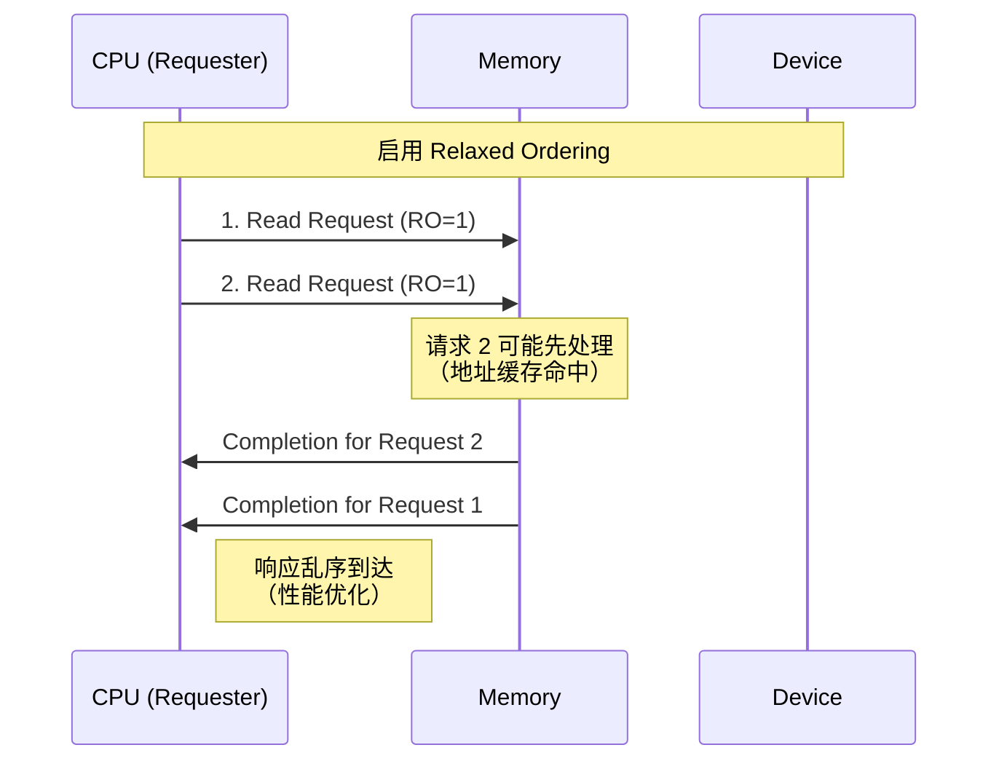

# 排序规则 (Ordering Rules)

PCIe 排序规则定义了不同类型的 TLP 之间必须遵守的先后顺序关系，确保数据一致性和正确性。

---

## 概述

在 PCIe 系统中，多个 TLP 可能同时在链路上传输。排序规则确保：
- **数据一致性**：写操作在读操作之前完成
- **Producer-Consumer 模型**：生产者的数据对消费者可见
- **性能优化**：允许某些 TLP 乱序执行以提高效率

**为什么需要排序规则？**

```
场景：CPU 写入数据到内存，然后通知设备读取

Without Ordering:
  1. CPU: Write Data to Memory
  2. CPU: Write Doorbell to Device  ← 可能先到达！
  3. Device: Read Memory            ← 读到旧数据（错误）

With Ordering:
  1. CPU: Write Data to Memory
  2. CPU: Write Doorbell to Device  ← 必须等待步骤 1
  3. Device: Read Memory            ← 读到新数据（正确）
```

---

## TLP 分类

排序规则基于 TLP 的三种基本类型：

| 类型 | 英文 | 特点 | 示例 |
|-----|------|------|------|
| **Posted** | Posted Request | 无需响应，发送即遗忘 | Memory Write, Message |
| **Non-Posted** | Non-Posted Request | 需要 Completion 响应 | Memory Read, IO Read/Write, Config Read/Write |
| **Completion** | Completion | 对 Non-Posted 的响应 | Completion (with/without Data) |

**关键区别**：

```
Posted Request (Memory Write):
  Requester ──[MWr]──> Completer
            (无响应，直接返回)

Non-Posted Request (Memory Read):
  Requester ──[MRd]──> Completer
            <─[Cpl]─── Completer
            (等待 Completion 才能继续)
```

---

## 基本排序规则

### 规则表（简化版）

下表显示**后发送的事务**（列）是否可以**超越先发送的事务**（行）：

```
                  后发送的事务 →
              ┌─────────┬─────────┬─────────┐
              │ Posted  │Non-Post │  Cpl    │
先 ┌─────────┼─────────┼─────────┼─────────┤
发 │ Posted  │   No    │   Yes   │   Yes   │
送 ├─────────┼─────────┼─────────┼─────────┤
的 │Non-Post │   No    │   No    │   Yes   │
事 ├─────────┼─────────┼─────────┼─────────┤
务 │  Cpl    │   No    │   No    │   Yes   │
↓  └─────────┴─────────┴─────────┴─────────┘

No  = 不允许超越（必须保持顺序）
Yes = 允许超越（可以乱序）
```

**解读**：
- ✅ **Non-Posted 可以超越 Posted**：读请求不需要等待前面的写操作
- ❌ **Posted 不能超越 Posted**：写操作必须按顺序执行
- ❌ **Non-Posted 不能超越 Non-Posted**：读操作必须按顺序
- ✅ **Completion 可以超越大部分**：响应可以灵活返回

### 详细排序规则表

更完整的规则（考虑地址和 ID）：

| 先发送 | 后发送 | 相同地址/ID | 不同地址/ID |
|-------|-------|------------|------------|
| Posted Write | Posted Write | **必须有序** | **必须有序** |
| Posted Write | Read Request | 可乱序 | 可乱序 |
| Posted Write | Read Completion | 可乱序 | 可乱序 |
| Read Request | Posted Write | **必须有序** | **必须有序** |
| Read Request | Read Request | **必须有序** | **必须有序** |
| Read Request | Read Completion | 可乱序 | 可乱序 |
| Read Completion | Posted Write | **必须有序** | **必须有序** |
| Read Completion | Read Request | **必须有序** | **必须有序** |
| Read Completion | Read Completion | 可乱序 (不同 ID) | 可乱序 |

---

## Producer-Consumer 模型

这是理解排序规则最重要的模型。

### 模型说明

```
Producer (生产者)              Consumer (消费者)
     │                              │
     │ 1. Write Data               │
     ├──────[Posted Write]────────>│
     │                              │
     │ 2. Write Flag/Doorbell      │
     ├──────[Posted Write]────────>│
     │                              │ 3. Check Flag
     │                              │ 4. Read Data
     │      <─────[Read Request]────┤
     │                              │
     │ 5. Return Data               │
     ├──────[Completion]──────────>│
     │                              │
```

**关键保证**：
1. **步骤 2 的 Flag 写入不能超越步骤 1 的数据写入**（Posted → Posted 有序）
2. Consumer 看到 Flag 后，读取的数据一定是最新的

### 代码示例（NVMe Doorbell）

```c
// FEMU: hw/femu/nvme.c
// Producer: 主机写入 NVMe 命令

// 1. 主机写入命令到 Submission Queue
memcpy(sq->addr, &cmd, sizeof(cmd));  // Posted Write 1

// 2. 主机写入 Doorbell 寄存器通知设备
nvme_write_doorbell(n, sq->tail);     // Posted Write 2
// ↑ 排序规则确保这个写入不会超越步骤 1

// Consumer: 设备处理命令
static void nvme_process_sq(NvmeCtrl *n, NvmeSQ *sq)
{
    // 3. 设备读取 Doorbell（内存映射读取）
    uint16_t new_tail = nvme_read_doorbell(n);
    
    // 4. 设备从内存读取命令（Non-Posted Read）
    NvmeCmd cmd;
    pci_dma_read(pci_dev, sq->dma_addr, &cmd, sizeof(cmd));
    // ↑ 排序规则确保能读到步骤 1 写入的最新数据
    
    nvme_process_cmd(n, &cmd);
}
```

---

## Relaxed Ordering (宽松排序)

### 概念

Relaxed Ordering (RO) 是 TLP Header 中的一个属性位，允许**某些严格的排序规则被放宽**以提高性能。

```
TLP Header Byte 1:
┌─────┬─────┬────┬────┬────┬────┬────┬────┐
│ ... │ TC  │ .. │ .. │Attr│ .. │ .. │ .. │
└─────┴─────┴────┴────┴────┴────┴────┴────┘
                      ↑
                  Attr[2]: Relaxed Ordering bit
```

**启用 RO 后的变化**：

| 先发送 (RO=1) | 后发送 | 原规则 | RO 规则 |
|--------------|--------|--------|---------|
| Posted Write | Read Request | 可乱序 | 可乱序（不变）|
| Read Request | Posted Write | **必须有序** | **可乱序** ✨ |
| Read Request | Read Request | **必须有序** | **可乱序** ✨ |

### 适用场景

**适合使用 RO**：
- ✅ 图形渲染：帧缓冲区更新（顺序不重要）
- ✅ 批量数据传输：大文件复制
- ✅ 独立数据块：数据库分区扫描

**不适合使用 RO**：
- ❌ Producer-Consumer 模型（需要严格顺序）
- ❌ 硬件寄存器访问（顺序敏感）
- ❌ 同步原语（锁、信号量）

### FEMU 代码实现

```c
// include/standard-headers/linux/pci_regs.h
#define PCI_EXP_DEVCTL_RELAX_EN  0x0010  // Enable Relaxed Ordering

// hw/pci/pcie.c
void pcie_cap_init(PCIDevice *dev, uint8_t offset,
                   uint8_t type, uint8_t version)
{
    uint8_t *exp_cap = dev->config + offset;
    
    // Device Control 寄存器
    uint16_t devctl = pci_get_word(exp_cap + PCI_EXP_DEVCTL);
    
    // 启用 Relaxed Ordering（可选）
    if (dev->cap_present & QEMU_PCIE_CAP_RO) {
        devctl |= PCI_EXP_DEVCTL_RELAX_EN;
    }
    
    pci_set_word(exp_cap + PCI_EXP_DEVCTL, devctl);
}
```

### Linux 驱动示例

```c
// Linux Kernel: drivers/pci/pcie/pci.c
int pcie_relaxed_ordering_enabled(struct pci_dev *dev)
{
    u16 v;
    
    pcie_capability_read_word(dev, PCI_EXP_DEVCTL, &v);
    
    return !!(v & PCI_EXP_DEVCTL_RELAX_EN);
}

// 启用 Relaxed Ordering
void pcie_enable_relaxed_ordering(struct pci_dev *dev)
{
    pcie_capability_set_word(dev, PCI_EXP_DEVCTL,
                             PCI_EXP_DEVCTL_RELAX_EN);
}
```

---

## ID-Based Ordering (IDO)

### 概念

ID-Based Ordering (IDO) 是 PCIe 3.0 引入的特性，进一步放宽排序约束。

**两个独立的 IDO 位**：
1. **IDO Request**：允许请求之间乱序
2. **IDO Completion**：允许完成响应之间乱序

```
Device Control 2 寄存器:
┌────────┬────────┬─────┬─────┬─────┬─────┐
│   ..   │   ..   │ IDO │ IDO │ ... │ ... │
│        │        │ Cpl │ Req │     │     │
└────────┴────────┴─────┴─────┴─────┴─────┘
                    Bit 9  Bit 8
```

### IDO 规则

**IDO Request 启用时**：
- 不同 Transaction ID 的请求可以乱序
- 提高多线程/多核场景的并发性

**IDO Completion 启用时**：
- 返回给不同请求者的 Completion 可以乱序
- 提高多设备响应效率

### FEMU 代码实现

```c
// include/standard-headers/linux/pci_regs.h
#define PCI_EXP_DEVCTL2_IDO_REQ_EN  0x0100  // IDO for Requests
#define PCI_EXP_DEVCTL2_IDO_CMP_EN  0x0200  // IDO for Completions

// 启用 IDO (假设的实现)
void pcie_enable_ido(PCIDevice *dev)
{
    uint8_t *exp_cap = dev->config + dev->exp.exp_cap;
    uint16_t devctl2;
    
    devctl2 = pci_get_word(exp_cap + PCI_EXP_DEVCTL2);
    
    // 启用 Request 和 Completion 的 IDO
    devctl2 |= PCI_EXP_DEVCTL2_IDO_REQ_EN;
    devctl2 |= PCI_EXP_DEVCTL2_IDO_CMP_EN;
    
    pci_set_word(exp_cap + PCI_EXP_DEVCTL2, devctl2);
}
```

---

## 排序规则流程图

### 写后读场景



### 乱序执行场景（启用 RO）



---

## 实际应用场景

### 场景 1: DMA 写入 + 中断

**需求**：设备通过 DMA 写入数据到内存，然后发送 MSI 中断通知 CPU。

```c
// FEMU: hw/femu/nvme-io.c
static void nvme_rw_cb(void *opaque, int ret)
{
    NvmeRequest *req = opaque;
    NvmeSQ *sq = req->sq;
    NvmeCtrl *n = sq->ctrl;
    
    // 1. DMA 写入完成数据到主机内存
    if (req->is_write) {
        pci_dma_write(&n->parent_obj, req->slba, 
                      req->data, req->nlb * 512);  // Posted Write
    }
    
    // 2. 更新 Completion Queue Entry
    nvme_post_cqe(req->cq, req);  // Posted Write
    
    // 3. 发送 MSI-X 中断
    msix_notify(&n->parent_obj, req->cq->vector);  // Message (Posted)
    
    // ↑ 排序规则确保：中断不会在 DMA 写入前到达 CPU
}
```

**排序保证**：
- 步骤 3 的中断（Message）不会超越步骤 1 的 DMA 写入（Posted Write）
- CPU 收到中断时，数据已在内存中

### 场景 2: NVMe 命令提交

```c
// Linux NVMe 驱动
void nvme_submit_cmd(struct nvme_queue *nvmeq, struct nvme_command *cmd)
{
    // 1. 写入命令到 Submission Queue
    memcpy(&nvmeq->sq_cmds[nvmeq->sq_tail], cmd, sizeof(*cmd));
    // ↓ 内存屏障确保写入可见
    wmb();
    
    // 2. 更新 Tail Doorbell
    if (++nvmeq->sq_tail == nvmeq->q_depth)
        nvmeq->sq_tail = 0;
    
    // 3. 写入 Doorbell 寄存器（通知设备）
    writel(nvmeq->sq_tail, nvmeq->q_db);  // Posted Write to PCIe
    
    // ↑ PCIe 排序规则 + CPU 内存屏障 = 双重保证
}
```

### 场景 3: GPU 帧缓冲区更新（适合 RO）

```c
// 图形驱动：批量更新帧缓冲区
void gpu_update_framebuffer(struct gpu_device *gpu, 
                            struct frame_data *frames, int count)
{
    // 启用 Relaxed Ordering（帧之间独立）
    pcie_enable_relaxed_ordering(gpu->pdev);
    
    for (int i = 0; i < count; i++) {
        // 每个帧的更新可以乱序执行
        dma_copy_to_gpu(gpu, frames[i].data, 
                       frames[i].offset, 
                       frames[i].size);  // Posted Write with RO=1
    }
    
    // 最后一个同步点：等待所有传输完成
    gpu_wait_dma_complete(gpu);
}
```

---

## 实现参考（FEMU 代码）

### 1. 配置空间读取排序属性

```c
// hw/pci/pcie.c
int pcie_cap_init(PCIDevice *dev, uint8_t offset,
                  uint8_t type, uint8_t version)
{
    // 初始化 PCIe Capability
    uint8_t *exp_cap = dev->config + offset;
    
    // Device Capabilities: 指示支持的特性
    uint32_t devcap = 0;
    devcap |= QEMU_PCI_EXP_DEVCAP_RBER;  // Role-Based Error Reporting
    pci_set_long(exp_cap + PCI_EXP_DEVCAP, devcap);
    
    // Device Control: 控制排序行为
    uint16_t devctl = 0;
    // Relaxed Ordering 默认禁用（可通过软件启用）
    pci_set_word(exp_cap + PCI_EXP_DEVCTL, devctl);
    
    return offset;
}
```

### 2. TLP 属性设置（概念性）

```c
// 假设的 TLP 发送函数
void pcie_send_memory_write(PCIDevice *dev, uint64_t addr,
                            void *data, size_t len, bool relaxed_ordering)
{
    TLPHeader hdr = {0};
    
    // 设置 Fmt/Type
    hdr.fmt_type = TLP_FMT_3DW_DATA | TLP_TYPE_MEM_WRITE;
    
    // 设置 Attributes
    if (relaxed_ordering) {
        hdr.attr |= TLP_ATTR_RELAXED_ORDERING;  // Attr[2] = 1
    }
    
    // 设置地址和长度
    hdr.address = addr;
    hdr.length = (len + 3) / 4;  // DW 为单位
    
    // 发送 TLP
    pcie_transmit_tlp(dev, &hdr, data, len);
}
```

### 3. PCI-X Relaxed Ordering

```c
// include/standard-headers/linux/pci_regs.h
// PCI-X 也支持 Relaxed Ordering
#define PCI_X_CMD_ERO  0x0002  // Enable Relaxed Ordering

// 在 PCI-X 模式下启用 RO
void pcix_enable_relaxed_ordering(PCIDevice *dev)
{
    if (dev->cap_present & QEMU_PCI_CAP_PCIX) {
        uint16_t pcix_cmd;
        uint8_t offset = pci_find_capability(dev, PCI_CAP_ID_PCIX);
        
        pcix_cmd = pci_get_word(dev->config + offset + PCI_X_CMD);
        pcix_cmd |= PCI_X_CMD_ERO;
        pci_set_word(dev->config + offset + PCI_X_CMD, pcix_cmd);
    }
}
```

---

## 实用技巧

### 1. 调试排序问题

**使用 PCIe 分析仪观察 TLP 顺序**：
```bash
# 查看设备的排序设置
lspci -vvv -s 01:00.0 | grep -i "relaxed"
  DevCtl: ... RelaxedOrd- ...

# 启用 Relaxed Ordering (需要驱动支持)
setpci -s 01:00.0 CAP_EXP+8.w=0010:0010
```

**使用内存屏障**：
```c
// CPU 侧确保顺序
wmb();   // Write Memory Barrier
rmb();   // Read Memory Barrier
mb();    // Full Memory Barrier

// 示例：
memcpy(data_buffer, data, size);
wmb();  // 确保写入完成
writel(doorbell_value, doorbell_reg);  // 触发 PCIe Posted Write
```

### 2. 性能优化

**何时启用 Relaxed Ordering**：
```c
// 适合的场景
if (workload_is_independent() && !requires_strict_order()) {
    pcie_enable_relaxed_ordering(dev);
}

// 不适合的场景
if (producer_consumer_model() || register_access()) {
    // 保持默认顺序
}
```

**批量操作优化**：
```c
// 不好的做法：频繁的小写入
for (i = 0; i < 1000; i++) {
    write_register(dev, i, data[i]);  // 1000 个 TLP
}

// 好的做法：合并为大传输
dma_write_bulk(dev, 0, data, 1000 * sizeof(data[0]));  // 更少的 TLP
```

### 3. 兼容性考虑

**检查设备能力**：
```c
// 检查设备是否支持 Relaxed Ordering
bool supports_ro(struct pci_dev *pdev)
{
    u16 cap;
    pcie_capability_read_word(pdev, PCI_EXP_DEVCAP, &cap);
    
    // PCIe 设备通常都支持，但要验证
    return true;  // 大多数设备支持
}

// 检查 IDO 支持
bool supports_ido(struct pci_dev *pdev)
{
    u32 cap2;
    pcie_capability_read_dword(pdev, PCI_EXP_DEVCAP2, &cap2);
    
    return !!(cap2 & (PCI_EXP_DEVCAP2_IDO_REQ | 
                      PCI_EXP_DEVCAP2_IDO_CMP));
}
```

---

## 常见陷阱

### 陷阱 1: 忘记 CPU 内存屏障

```c
// 错误：只依赖 PCIe 排序
data_buffer[0] = 0x12345678;
writel(doorbell, reg);  // 可能在数据写入前到达 PCIe 总线！

// 正确：添加内存屏障
data_buffer[0] = 0x12345678;
wmb();  // CPU 内存屏障
writel(doorbell, reg);  // 现在顺序正确
```

**原因**：PCIe 排序规则只保证 PCIe 总线上的 TLP 顺序，不保证 CPU 内存操作顺序。

### 陷阱 2: 错误使用 Relaxed Ordering

```c
// 危险：在 Producer-Consumer 场景使用 RO
data[index] = new_value;
write_flag(flag_register, READY);  // 如果启用 RO，可能乱序！

// 安全：禁用 RO 或添加同步
data[index] = new_value;
mb();  // 强制屏障
write_flag(flag_register, READY);
```

### 陷阱 3: Completion 匹配错误

```c
// 错误：假设 Completion 按顺序返回
send_read_request(addr1, tag=0);
send_read_request(addr2, tag=1);
// Tag=1 的响应可能先到达！

// 正确：使用 Tag 匹配
completion = wait_completion();
switch (completion.tag) {
    case 0: handle_addr1_data(); break;
    case 1: handle_addr2_data(); break;
}
```

---

## 总结

### 关键要点

1. ✅ **三种 TLP 类型**：Posted、Non-Posted、Completion 有不同的排序约束
2. ✅ **Producer-Consumer 模型**：Posted → Posted 必须有序，保证数据一致性
3. ✅ **Relaxed Ordering**：性能优化特性，但需谨慎使用
4. ✅ **ID-Based Ordering**：PCIe 3.0+ 特性，进一步提升并发性
5. ✅ **内存屏障 + PCIe 排序**：双重保证确保正确性

### 排序规则速查表

| 场景 | 排序要求 | 优化建议 |
|-----|---------|---------|
| 数据写入 + Doorbell | Posted → Posted (有序) | 无需优化 |
| DMA 写入 + 中断 | Posted → Message (有序) | 无需优化 |
| 读请求序列 | Non-Posted → Non-Posted (有序) | 考虑启用 RO |
| 独立数据块传输 | 默认有序 | **启用 RO** 提升性能 |
| 多线程读取 | 默认有序 | **启用 IDO** 提升并发 |

---

## 下一步学习

- [TLP 格式详解](tlp-format.md) - 理解 TLP 结构和 Attr 字段
- [流控制机制](flow-control.md) - 信用管理与排序的关系
- [错误处理](../error-handling/aer.md) - 排序错误的检测和恢复
- [性能优化](../advanced/performance.md) - 利用排序规则提升性能

---

## 参考资料

- **规范**：PCIe Base Spec Revision 5.0
  - Chapter 2.4: Transaction Ordering
  - Table 2-40: Ordering Rules Summary
  - Appendix C: Ordering Rules Examples
- **代码**：
  - `include/standard-headers/linux/pci_regs.h` - 寄存器定义
  - `hw/pci/pcie.c` - FEMU PCIe 实现
- **图表**：
  - Figure 2-30: Producer-Consumer Ordering Model
  - Figure 2-31: Ordering Rules Flowchart

---

**相关页面**：
- [← TLP 格式](tlp-format.md)
- [流控制 →](flow-control.md)
- [返回首页](../README.md)

---

*最后更新：2026-07-06*  
*字数：约 4800 字*
